# Installation

## Vorabinformation

Die Installation auf dem Client (eigener Rechner mit Windows, Linux, MacOS) 
ist im Regelfall völlig problemlos und wird nachfolgend noch genau beschrieben.
Für einen Git-Server braucht man -- wie schon der Name sagt -- einen Server.
Da es für einfache Versuche etwas aufwändig ist, sich eine entsprechende Installation
im Internet zu mieten, greifen wir in diesem Workshop auf virtuelle Umgebungen zurück.
Dafür werden wir den vorhandenen Arbeitsplatzrechner uminstallieren (Proxmox) und darauf 
dann ein aktuelles Ubuntu als virtuelles Serversystem. Die Installation dieser Infrastruktur 
ist im Anhang genauer beschrieben. Es ist natürlich auch möglich, einen Spielserver 
mit Hilfe von Virtualbox auf dem eigenen Computer zu installieren.

## Client-Installation

Für die ersten Schritte mit \git ist es sehr sinnvoll, eine ganz einfache 
Client-Software (kurz Client) zu verwenden. Hier ist *einfach* nicht im Sinne 
von *einfacher Bedienung* sondern eher im Sinne von *ursprünglicher Version* gemeint. 
Mittlerweile bringt jede Entwicklungsumgebung bereits
eine eigene Version eines \git-Clients mit und wir können beim besten Willen 
nicht jede Variante, eventuell noch mit eigenen Features, besprechen.

Faktisch gibt es eigentlich keinen reinen \git-Client, weil immer 
automatisch Client und Server installiert werden. Gerade bei Windows 
bedeutet das aber nicht, dass man den Server auch verwenden kann. Hier 
hat Microsoft so viele Hindernisse in den Weg gelegt, dass man besser die 
Finger davon lässt!

### Windows

Für die Installation auf Windows ist es hilfreich, wenn du dich an 
folgende Reihenfolge hältst:

* Notepad++ installieren
* Git installieren

#### Notepad++

Lade von [notepad-plus-plus.org](https://notepad-plus-plus.org/downloads/) 
den Editor *notepad++* herunter und installiere das 
Programm durch den üblichen Doppelklick. Es gibt keine Stellen, wo das Vorgehen nicht eindeutig wäre. Du wirst später bei der Installation von \git nach diesem Programm gefragt werden!  

#### Git

Lade von [gitforwindows.org](https://gitforwindows.org) die
Installationsdatei herunter.

Starte nun die Installation von \git durch Doppelklick auf die 
Installationsdatei. Die nachfolgenden Bilder zeigen den Ablauf
in der Version vom November 2025. Beachte, dass dieses Handout 
für die digitale Verwendung gedacht ist -- aus diesem Grund füge
ich die Bilderstrecke hier ein. Für einen Ausdruck wäre das 
Verschwendung!

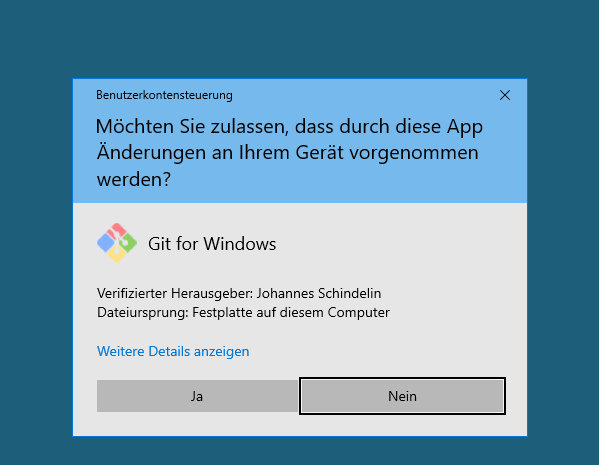{width=50%}
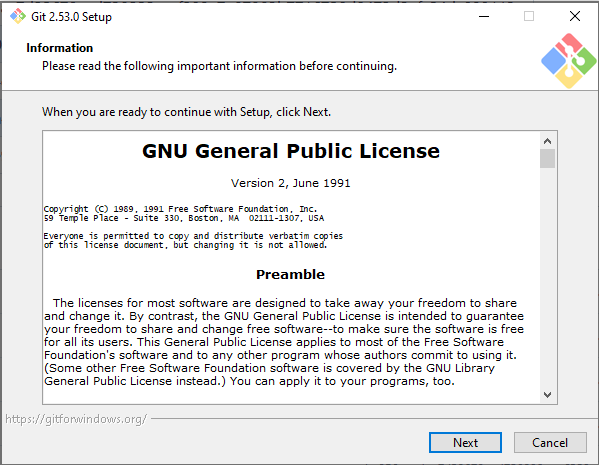{width=50%}

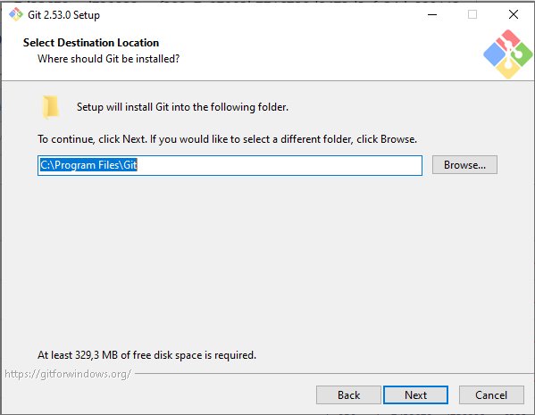{width=50%}
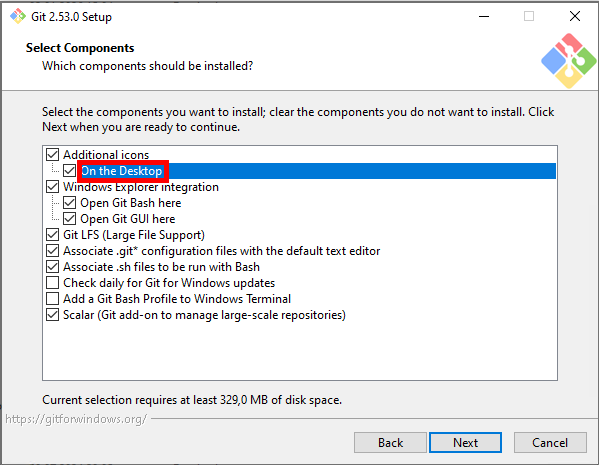{width=50%}

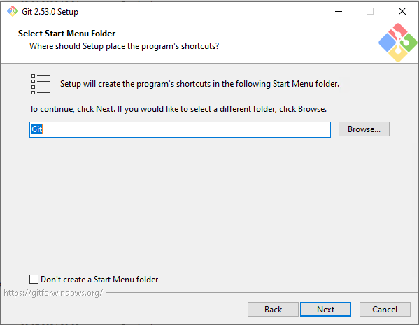{width=50%}
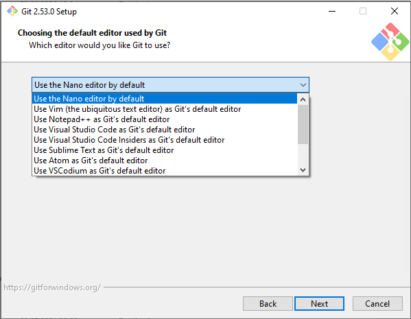{width=50%}

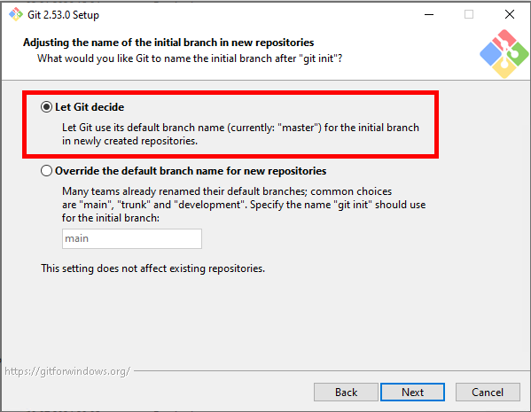{width=50%}
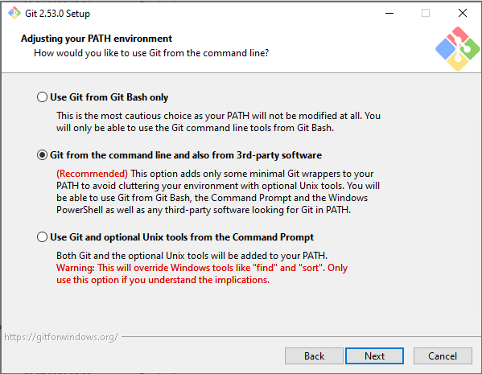{width=50%}

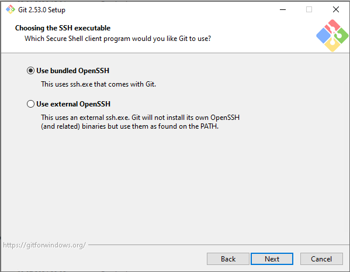{width=50%}
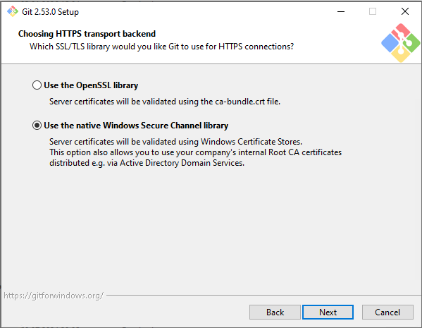{width=50%}

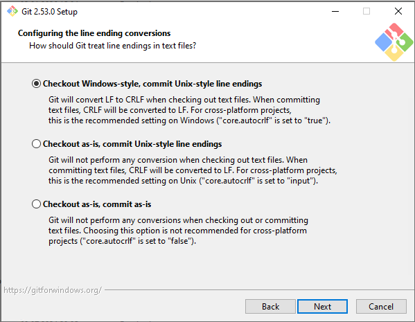{width=50%}
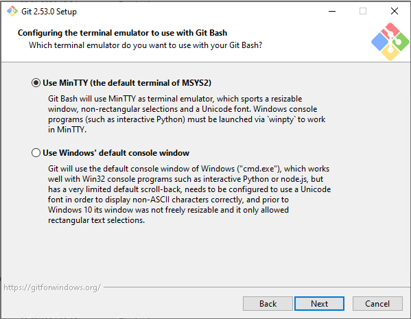{width=50%}

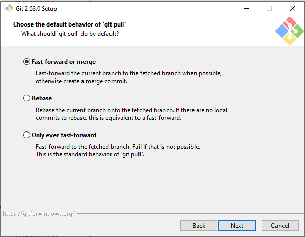{width=50%}
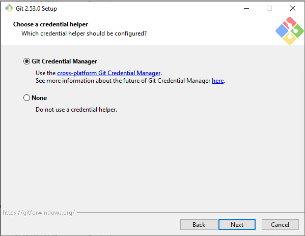{width=50%}

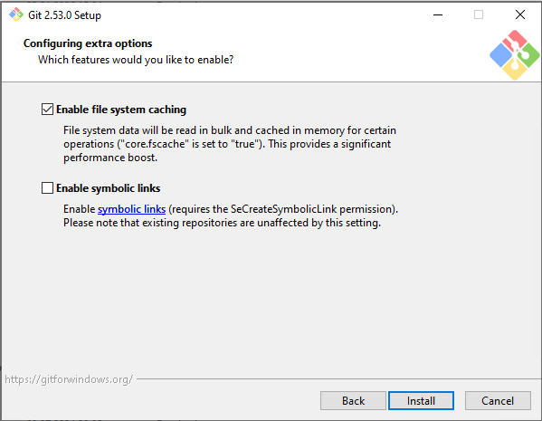{width=50%}
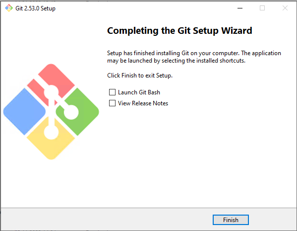{width=50%}


### Linux

Hier hängt es etwas von der Distribution ab. Bei Ubuntu genügt der 
Befehl 

```bash
apt install git -y
```

Bei der Installation von Ubuntu-Server wird \git allerdings gleich mit installiert.

### MacOS

MacOS ist ähnlich pflegeleicht. Mit \cmd{brew install git} 
ist die Installation ebenfalls bereits gestartet und nach kurzer 
Zeit beendet.

