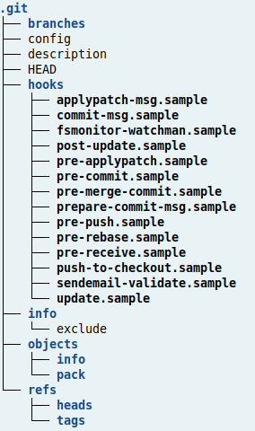
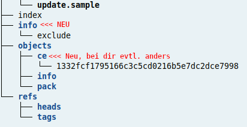
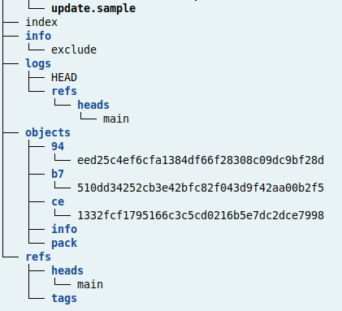

# Hands On I
## Übung
Besonders bei komplexen Systemen wie \git gilt *use it or lose it*! In diesem Sinne kommt hier nun ein winziger *Projektauftrag:

> Erstelle in einem Repository ein Mini-Projekt in deiner 
> üblichen Programmiersprache. Idealer Weise besteht es aus 
> mehreren Dateien. Für jede Änderung am Code soll ein 
> Commit erstellt werden.
> Verschaffe dir im Anschluss einen Überblick über die 
> Commit-History.

## Ein genauerer Blick auf Git

Steht ein Ordner unter der Verwaltung von \git, so kann 
man von drei *logischen* Bereichen sprechen:

* \work (Arbeitsordner)
* Stage (auch Index oder Cache genannt)
* Repository^[Je nach Quelle und Kontext wird der Begriff etwas inkonsistent verwendet]

Das \work enthält die Dateien an denen gearbeitet 
wird. Er entspricht auf den ersten Blick genau einem normalen 
Ordner für die Projektentwicklung. Erst durch die Initialisierung 
durch \git entsteht dann ein weiterer, versteckter Ordner mit dem Namen *.git*.
Dieser Ordner bildet gleichzeitig den *Stage* und das *Repository*^[Hier siehst du den 
inkonsistenten Gebrauch von „Repository“. Einerseits wird der gesamte Projektorder 
als Repository bezeichnet, sobald er von \git verwaltet wird, andererseits
befindet sich das eigentliche Repository im Ordner *.git*.]. 

\samplestart
**Hinweis**  
Es kann sein, dass in deinem Betriebssystem Ordner 
mit einem führenden Punkt nicht angezeigt werden. 
Dies aber üblicherweise im Dateimanager konfigurierbar.
\sampleend

*Logische Bereiche* bedeutet in diesem Zusammenhang, dass diese beiden 
Bereiche von \git verwaltet werden und vom unbedarften 
Benutzer nicht einfach unterschieden werden können.
In einem späteren Abschnitt werden wir einen genaueren 
Blick in diesen Ordner werfen.

Betrachten wir zunächst einen Entwicklungszyklus im Detail. Dabei 
wirst du im Wesentlichen die gleichen Befehle wie vorher verwenden, 
allerdings untersuchen wir einige Varianten, die für das Verständnis 
wichtig sind.

Du bist immer noch im aktuellen Ordner \ordner{versuch1}. 
Er sollte akutell eine Datei und zwei Commits enthalten.  
Das kannst du mit folgendem Befehl überprüfen:

```bash
git log
```

liefert 

```bash
commit 6db4f3383512a7f3aaaf3b050334d7fd2c474688 (HEAD -> main)
Author: Wolfgang <hoeferwolf@t-online.de>
Date:   Thu Nov 13 10:46:50 2025 +0100

    Erläuterung

commit 430149c83906005ae2c53c8eaf9ce230e3456ad0
Author: Wolfgang <hoeferwolf@t-online.de>
Date:   Thu Nov 13 10:46:50 2025 +0100

    Erste Datei erstellt
```

Ob noch Änderungen offen sind,zeigt dir:

```bash
# Eingabe
git status

# Ausgabe (Zeilenumbrüche geändert)
Auf Branch main
nichts zu committen, 
Arbeitsverzeichnis unverändert
```

Das bedeutet, dass du aktuell einen *sauberen* Zustand 
deines Arbeitsordners ohne Änderungen vorliegen hast.

Erstelle nun eine neue \datei{datei2.txt} und füge 
die Zeile *Version 1* ein. In der Datei \datei{datei1.txt}
kommt die Zeile *Version 3* dazu:

```bash
# Eingabe (Lasse ich zukünftig weg)
echo "Version 3" >> datei1.txt
echo "Version 1" >> datei2.txt

# Status anzeigen lassen 
git status 

# Ausgabe
Auf Branch main
Änderungen, die nicht zum Commit vorgemerkt sind:  
  (benutzen Sie "git add <Datei>...",  
   um die Änderungen zum Commit vorzumerken)
  
  (benutzen Sie "git restore <Datei>...",  
   um die Änderungen im Arbeitsverzeichnis zu verwerfen)  

	geändert:       datei1.txt

Unversionierte Dateien:
  (benutzen Sie "git add <Datei>...", 
   um die Änderungen zum Commit vorzumerken)

	datei2.txt

keine Änderungen zum Commit vorgemerkt 
(benutzen Sie "git add" und/oder "git commit -a")
```

Es wird dir angezeigt, dass Änderungen im \work vorliegen.  
Du siehst auch, dass \git die \datei{datei1.txt} bereits kennt 
(=geändert) und  dass \datei{datei2.txt} noch nicht in die  
Versionsverwaltung aufgenommen wurde (=unversioniert).

\samplestart
**Vorsicht**  
Es gibt den Befehl \cmd{git commit -am "bemerkung"}.  
Hier musst du wissen, dass nur bereits versionierte 
Dateien in geänderter Form in den Commit übernommen 
werden -- \datei{datei2.txt} würde also ignoeriert.  
\sampleend

Übertrage nun die Änderungen beider Dateien *auf den Stage*/*in den Stage*:

```bash
# Deien aufnehmen
git add .

# Status abzeigen
git status 

# Ausgabe  
Auf Branch main
Zum Commit vorgemerkte Änderungen:
  (benutzen Sie "git restore --staged <Datei>..."  
   zum Entfernen aus der Staging-Area)  

	geändert:       datei1.txt
	neue Datei:     datei2.txt
```

Diese Dateien sind nun zum Commit vorgemerkt, also zum festen Eintrag in die Projekthistorie -- Das führst du 
jetzt aber **nicht aus**!

Als Demonstration fügen wir beiden Dateien eine weitere 
Zeile hinzu und fragen wieder den Status ab:

```bash
echo "Weitere Zeile" >> datei1.txt  
echo "Weitere Zeile" >> datei2.txt 
git status 

# Ausgabe ( "----"" sind Anmerkungen )
Auf Branch main
Zum Commit vorgemerkte Änderungen:
  (benutzen Sie "git restore --staged <Datei>..."  
   zum Entfernen aus der Staging-Area)
	
    geändert:       datei1.txt
	  neue Datei:     datei2.txt

--------------- Ende Stage ------------
--------------- Anfang Workdir --------

Änderungen, die nicht zum Commit vorgemerkt sind:
  (benutzen Sie "git add <Datei>...", um die Änderungen 
   zum Commit vorzumerken)
  
  (benutzen Sie "git restore <Datei>...", 
   um die Änderungen im Arbeitsverzeichnis zu verwerfen)

	geändert:       datei1.txt
	geändert:       datei2.txt
```

Beide Dateien liegen also in verschiedenen Versionen im Stage und im \work vor.  
Ein Commit transferiert **nur** die Versionen der Dateien aus dem Stage ins 
Repository, also in die Projekthistorie. Das führt dann zu folgender Situation:

```bash
git commit -m "nur Stage"
```

```bash
git Status

# Ausgabe 
Auf Branch main
Änderungen, die nicht zum Commit vorgemerkt sind:
  (benutzen Sie "git add <Datei>...", um die Änderungen zum Commit vorzumerken)
  (benutzen Sie "git restore <Datei>...", um die Änderungen im Arbeitsverzeichnis zu verwerfen)
	geändert:       datei1.txt
	geändert:       datei2.txt

keine Änderungen zum Commit vorgemerkt (benutzen Sie "git add" und/oder "git commit -a")
```


Die oberen beiden Dateiversionen sind aus dem Stage verschwunden sind (sind jetzt Teil des Commits) und die 
aktuellen Änderungen sind nach wie vor im Arbeitsverzeichnis vorhanden 
sind, weil für sie noch kein *add* stattgefunden hat.

```bash
# Zum Stage hinzufügen
git add . 

git status

# Ausgabe

Auf Branch main
Zum Commit vorgemerkte Änderungen:
  (benutzen Sie "git restore --staged <Datei>..." zum Entfernen aus der Staging-Area)
	geändert:       datei1.txt
	geändert:       datei2.txt
```


\samplestart
**Hinweis**  
Wenn ich hier von *transferieren* spreche, so führt das
zu einer falschen Vorstellung. In Wirklichkeit werden
im *.git*-Ordner nur einige Verweise (Links, Zeiger) geändert -- wobei 
das auch wieder nicht die ganze Wahrheit ist!
\sampleend

### Etwas mehr Wahrheit
Dieser Abschnitt ist nur als Einblick für Interessierte gedacht!

Ganz am Anfang muss man wissen, dass es 4 Git-Objekte gibt:

1. blob
2. tree 
3. commit 
4. tag 

**blob**  
„Binary large Objects“ sind reine Dateiinhalte *ohne* Dateiname 
oder Metadaten.

**tree**  
Ein Tree ist ein (namentliches) Abbild des Arbeitsverzeichnisses. 
Er enthält aber nur die Namen, Typ und Hash der Dateien, Unterordner, 
also der Blobs und Trees, die an anderer Stelle gespeichert sind.
Ein Tree ist klein, da er keine Dateiinhalte enthält.

**commit**  
Ein Commit ist ein Zeiger auf den Tree, der zum Zeitpunkt des Commits aktuell war.
Er enthält noch weitere Metadaten.

**tag**  
Er ist ein Zusatznamen für ausgewählte Commits (Releases),
um ohne Kenntnis des Hashs darauf zugreifen zu können.


### Eigene Experimente  

Erstelle dir ein neues Repository in einem anderen Ordner

```bash
cd ..  # Eine Ebene höher, raus aus dem Arbeitsordner
git init demo 
cd demo
git branch -m main
```

Wenn du nun die Verzeichnisstruktur des Ordners *.git* 
genauer untersuchst, wirst du in etwa dies hier sehen,
weil noch keine Dateien im \work sind:



Lege nun im leeren \work eine Datei \datei{homepage.html} an^[Ich habe absichtlich 
nicht index.html verwendet, weil „index“ aktuell anders belegt ist.] 

```bash
echo "Etwas HTML" >> homepage.html
git add homepage.html 
```

Du siehst erste Änderungen im *.git*-Ordner.
Im Bild ist aus Platzgründen nur der
relevante Ausschnitt angezeigt. Bei dir kann der Hash
einen anderen Wert besitzen!



Die Datei \datei{index} stellt den *Stage* dar. Diese Datei kannst du nicht 
direkt lesen. Das geht nur mit

```bash
git ls-files --stage 
```

Den Hash aus dieser Ausgabe^[In einem richtigen großen Repository
erscheint hier eine sehr umfangreiche Liste aller Dateien!] 
findet du oben in der Ordnerstruktur wieder.

```bash
100644 ce1332fcf1795166c3c5cd0216b5e7dc2dce7998 0	homepage.htm
```

Allerdings wird mit den ersten beiden Zeichen (ce) ein Ordner erstellt und 
in diesem Ordner eine Datei, deren Name aus den restlichen Zeichen besteht. 
Zusätzlich findet man den Dateityp (100644), den Status (Das ist komplexer! 
Hier 0) und den Dateinamen.

Den Hash kannst du dir übrigens auch so anzeigen lassen:
```bash
git hash-object homepage.htm 
```

Aber gehen wir einen Schritt weiter und committen die Datei:
```bash
git commit -m "homepage.html added"
```

Nun sieht die Ordnerstruktur verändert aus -- die Hooks habe ich in der
Darstellung aus Platzgründen entfernt!




Ab hier bekommst du sicher andere, eigene Hash-Werte! Du 
musst in den nachfolgenden Befehlen also deine eigenen 
Werte verwenden.

Wir konzentrieren uns auf die *objects* und das *log*.

Mit \cmd{git log} erfährst du etwas über den erfolgten
Commit -- zum Beispiel seinen Hash:

```bash
commit b7510dd34252cb3e42bfc82f043d9f42aa00b2f5 (HEAD -> main)
Author: wolfgang <hoeferwolf@t-online.de>
Date:   Sun Jan 26 20:20:10 2025 +0100

    homepage.html added
```

Etwas kompakter wird die Darstellung mit \cmd{git log --oneline}.

Der Hash b751... scheint also ein Commit zu sein. Das kannst 
du mit \cmd{git cat-file -t b7510dd34252cb3e42bfc82f043d9f42aa00b2f5} 
auch noch einmal überprüfen -- steht aber bereits in \cmd{git log}. 

Änderst du den Parameter von *-t* auf *-p* (=pretty print), so 
bekommst du weitere Details: 

```bash
# Eingabe 
git cat-file -p b7510dd34252cb3e42bfc82f043d9f42aa00b2f5

# Ausgabe
tree 94eed25c4ef6cfa1384df66f28308c09dc9bf28d   << wichtig!
author wolfgang <hoeferwolf@t-online.de> 1737919210 +0100
committer wolfgang <hoeferwolf@t-online.de> 1737919210 +0100

homepage.html added
```

Am Commit verweist also auf den *tree* mit dem Hash 94ee...   
Da wir aktuell nur eine Datei haben, ist die Ausgabe des 
nächsten Befehls sehr kurz, der den Tree ausliest:


```bash
# Eingabe
git cat-file -p 94eed25c4ef6cfa1384df66f28308c09dc9bf28d

# Ausgabe - normal deutlich länger!
100644 blob ce1332fcf1795166c3c5cd0216b5e7dc2dce7998	homepage.html
```

Abschließend sehen wir uns den Inhalt des Blob an
```bash
# Eingabe
git cat-file -p ce1332fcf1795166c3c5cd0216b5e7dc2dce7998

# Ausgabe
Etwas HTML
```

Du bist jetzt über mehrere Stufen zum Inhalt der Datei gelangt.
Eine kleine Stufe haben wir aber ausgelassen:

```bash
git cat-file -t ce1332fcf1795166c3c5cd0216b5e7dc2dce7998
```

liefert die Information `blob` (Binary large object).

Hier nochmal die Zusammenfassung der Funktionsweise:  

* Der Commit zeigt auf einen Tree 
* Im Tree stehen Dateinamen mit den Hashes    
  Das sind nur die Namen und nicht die Dateien! 
* Der Hash gehört zu einem *blob* (oder tree),  
  also den reinen *Roh*daten der Datei **ohne** Dateinamen

Git verwendet das, um von verschiedenen Stellen aus auf die
gleichen Rohdaten verweisen zu können, ohne Speicher zu verbrauchen. 
Ändern sich Dateien zwischen 
zwei Commits *nicht* (Hash bleibt gleich), so werden sie nicht neu gespeichert. 
Der *neue* Commit zeigt auf einen *neuen* Tree in dem wieder 
die gleichen Hashes mit den gleichen Dateinamen stehen.

Tiefer will ich an dieser Stelle in dieses Thema nicht einsteigen!


