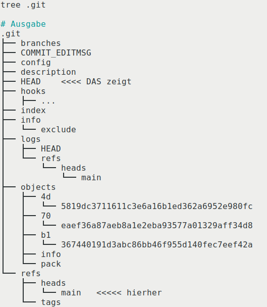
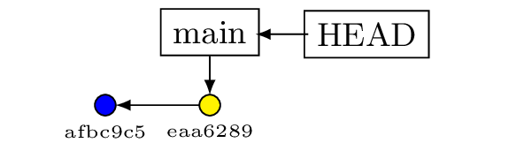
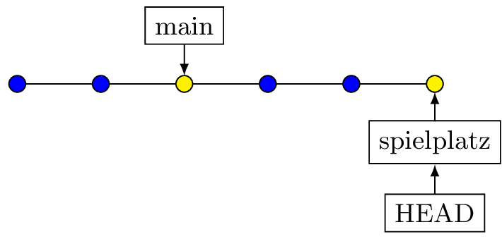
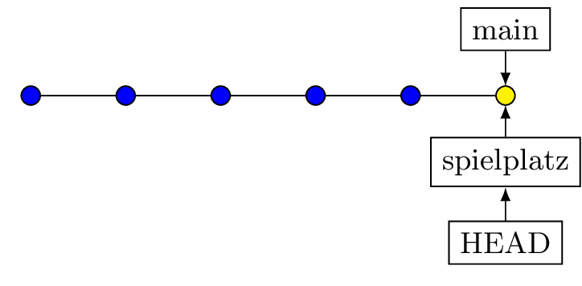
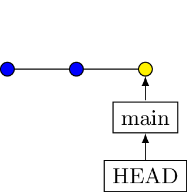
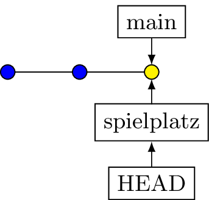

# Branches

Am Anfang ist es sinnvoll, wnn du das Bild eines Baumes im Kopf hat, bei dem 
sich der Stamm (=main Branch) an verschiedenen Stellen in Äste verzweigt.
Was in einem solchen Ast passiert, hat keinen Bezug zum Stamm und man kann Äste 
abschneiden (biologisch nur begrenzt richtig) ohne dass der Stamm Schaden nimmt.

Software-Projekte besitzen immer einen *main*-Branch und (mindestens) einen parallel 
dazu verlaufenden Entwichlungsbranch.

Für mich selbst sind Branches ganz wichtig, wenn ich Dinge ausprobieren will -- gerade 
bei Themen, wo ich nicht so fit bin. Dann nehme ich ein vorhandenes 
Projekt (dann muss ich weniger Boilerplate erzeugen) und erstelle 
beim aktuellen Stand eine Abzweigung mit dem Namen *Labor* oder *Spielplatz*
und probiere Dinge aus. Wenn ich scheitere (keine Ausnahme), dann lösche 
ich diesen Branch einfach wieder und es ist kein Schaden entstanden.  

Branches sind in Projekten aber auch wichtig, um die Entwicklungen 
verschiedener Mitarbeiter voneinander zu trennen -- sei es auf dem Server
(dazu später mehr) oder auf den individuellen Entwicklungsrechnern.

Im nachfolgenden *Hands On* werden wir uns das etwas genauer ansehen, hier 
kommen zunächst die Grundlagen.

## Erstellen von Branches

Im Internet findest du viele Seiten, die noch die alten Befehle von \git 
verwenden. Sie funktionieren immer noch, ich würde dir aber folgende Variante 
empfehlen:

```bash
git switch -c <branch_name>
```

Es ist wichtig zu verstehen, was ein Branch ist und vor allem was er *nicht* ist!
Dafür machen wir einige kleine Codebeispiele, die unabhängig von den bisherigen
Experimenten sind. Wie üblich richtest du dir zunächst ein Repository ein:

```bash
cd        # auf Start zurück
git init branch_lab
cd branch_lab 
git branch -m main 
```

Für einen ersten Commit erstellen wir eine (sinnfreie) Datei:

```bash
echo "Zeile 1" > datei.txt 
git add .
git commit -m "Datei 1 erstellt"
```

Das Log zeigt dann:

```bash
git log

# Ausgabe
commit 70eaef36a87aeb8a1e2eba93577a01329aff34d8 (HEAD -> main)
Author: Wolfgang <lehrer@t-online.de>
Date:   Fri Jan 23 12:57:41 2026 +0100

    Datei 1 erstellt
```

In der ersten Zeile sehen wir, dass es um den Branch \branch{main} geht 
und dass es einen `HEAD` gibt, der auf `main` zeigt. Das ist wichtig,
denn *zeigen* ist genau das benötigte Verb. Technisch ist das eine zweistufige
Verlinkung:

* In der Datei \datei{HEAD} steht \date{defs/heads/main}
* In der Datei \date{defs/heads/main} steht der Hash das aktuellen Commit.


\bcenter
{width=10cm}
\ecenter

Kurze Überprüfung direkt mit den Dateien:

Inhalt von \datei{HEAD}
```bash
cat .git/HEAD 

# Ausgabe
refs/heads/main
```

Inhalt von \datei{defs/heads/main}
```bash
cat .git/refs/heads/main 

# Ausgabe
70eaef36a87aeb8a1e2eba93577a01329aff34d8
```

Kommen weitere Commits hinzu, so ändert sich der Inhalt von `HEAD` nicht,
aber der Inhalt der \datei{.git/refs/heads/main} wird aktualisiert.

```bash
echo "Zeile 2" >> datei.txt 
git add . && git commit -m "Zeile 2"

echo "Zeile 3" >> datei.txt 
git add . && git commit -m "Zeile 3"

git log --oneline 

# Ausgabe 
7c5a585 (HEAD -> main) Zeile 3
1d4966e Zeile 2
70eaef3 Datei 1 erstellt
```

In der Datei steht nun:

```bash
cat .git/refs/heads/main 

# Ausgabe
7c5a5851fcb062c07a9b99195e33b97ee5353ab0
```

\bcenter

\ecenter

Der Pointer *main* wird also von Commit zu Commit geschoben 
und der Pointer *HEAD* zeigt ständig auf *main*.

Wenn wir nun einen Branch erstellen und auch gleich in diesen
wechseln -- das macht \cmd{git switch -c}, dann könne wir das 
auch in den Dateien nachverfolgen:

```bash
git switch -c spielplatz 
git log

# Ausgabe 
Zu neuem Branch 'spielplatz' gewechselt
commit 7c5a585...gekürzt (HEAD -> spielplatz, main)
Author: Wolfgang <lehrer@t-online.de>
Date:   Fri Jan 23 13:38:07 2026 +0100
```

Die erste Zeile gibt an, dass es zwei Branches gibt, die auf gleichem 
Stand sind (spielplatz und main). HEAD zeigt auf spielplatz, d.h. 
in der Datei \datei{Head} steht nicht mehr *ref: refs/heads/main*, sondern 

```bash
cat .git/HEAD

#Ausgabe
ref: refs/heads/spielplatz
```

Da *spielplatz* und *main* aber auf gleichem Stand -- dem aktuellen 
Commit -- sind, erhalten wir als Inhalt der Dateien den gleichen Hash:

```bash
cat .git/refs/heads/spielplatz
7c5a5851fcb062c07a9b99195e33b97ee5353ab0

cat .git/refs/heads/main
7c5a5851fcb062c07a9b99195e33b97ee5353ab0
```

Erst wenn im Branch \branch{spielplatz} neue Commits entstehen,
wird der Inhalt der Datei \datei{.git/refs/heads/spielplatz}
entsprechend mit dem aktualisierten Hash gefüllt.  

Ein neuerlicher Wechsel des Branches zurück auf \branch{main} 
bewirkt dann also nur noch eine Änderung der Verlinkung in 
der Datei \datei{.git/HEAD}.

## Zusammenführen von Branches (merge)
Dazu kommen weiter hinten im Script noch Varianten, deshalb möchte 
ich hier nur die Grundlagen thematisieren. *Merges* dienen dem Abgleich 
verschiedener Branches. Das ist nötig, wenn Änderungen am Code nicht 
nur in einem Branch verfügbar sein dürfen.  

Der unkomplizierteste Fall ist es, wenn du in einen Branch wechselst,
dort arbeitest und danach das Ergebnis direkt wieder in den ursprünglichen Branch
übernimmst. Dieser Vorgang wird *fast Forward (ff)* genannt, weil hier 
eigentlich gar nichts passiert, außer dass die Pointer passend umgeschrieben werden.


\bcenter
{width=45%}
{width=45%}
\ecenter


Eine typische Fehlvorstellung ist es, dass beim *Branching* sofort eine Abzweigung
erzeugt wird. Korrekt ist aber, dass einfach nur ein Zeiger (also eine Datei,
die einen Hash enthält) erzeugt wird, der auf den aktuellen Commit zeigt.


\bcenter
{width=30%}
{width=30%}
\ecenter

Der Befehl zur Zusammenführung wird vom Zielbranch aus gegeben. Du **holst** dir also einen Branch an deinen aktuellen Ort:

```bash
git switch main 
git merge spielplatz 
```

Komplizierter werden die Dinge, wenn in beiden Branches Änderungen an den 
Dateien vorgenommen werden -- dazu aber etwas später.

