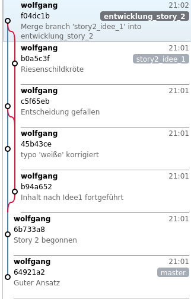

# Hands on II
Du wirst in diesem Abschnitt einige Dinge als redundant empfinden,
weil sie auch bereits früher verwendet wurden.
Sieh es einfach als Übung und da du dieses PDF ohnehin nicht 
ausdrucken wirst, ist die minimal erhöhte Seitenzahl auch kein Problem.

Dieses Szenario ist etwas komplexer, da wir mit mehreren Dateien
arbeiten und auch   
parallele Ideen verfolgen wollen (branching).   
Da richtiges Programmieren zu lange dauert, simulieren wir die 
Arbeit eines Autors, der an mehreren Kurzgeschichten arbeitet.
Die Geschichten wurden von einer KI generiert um den Arbeitsaufwand 
zu minimieren. 

Um diese Übung nachvollziehen kannst musst du:

* Vorlage auf deinen Computer *clonen*.  
  Das ist ein notwendiger Vorgriff auf den Abschnitt der Teamarbeit,
  den du hier einfach unhinterfragt ausführst.
* Anlegen eines eigenen Repositories
* Öffnen von 2 Fenstern der \gitbash. Eines für den Vorlagenordner 
  uns eines für den Buch-Ordner. Du musst ständig zwischen ihnen
  hin und her wechseln. Wenn dein Bildschirm groß genug ist, solltest
  du die Fenster nebeneinander legen.

\blarge
```bash
mkdir fortbildung
cd fortbildung
git clone https://github.com/gischupa/dillingen_storyvorlage.git vorlage 
```
\elarge

Es entsteht ein Ordner *vorlage*, in dem die 
verschiedenen Stände des Projektes enthalten sind.

Lege nun dein Repository an:

```bash
# Eingaben
mkdir buch 
cd buch 
git init
git branch -m main 
```

Im Ordner \ordner{fortbildungen sollten nun die Repositories \ordner{vorlage*}
und \ordner{buch} vorliegen.

## Teil eins von Story 1  
Wechsle in das Fenster mit dem **Vorlagenordner** und Checke *Step\_1* aus.

```bash
git checkout Step_1
```

Kopiere die Datei \datei{story1.md} in den Ordner \ordner{buch}.   

Diese Datei enthält (absichtlich) nur einen Teil der Geschichte! 
Das Kopieren kannst du auch gerne mit der Maus im Explorer machen,
ich beschreibe aber den schnelleren Weg über das Terminal:
  
```bash
# aktueller Ort ist der vorlagen-Ordner
cp story1.md  ../buch/ 
```

Wechsle in das Buch-Fenster
```bash
git status

# Ausgabe
Auf Branch main # <1>

Noch keine Commits

Unversionierte Dateien:
  (benutzen Sie "git add <Datei>...", 
   um die Änderungen zum Commit vorzumerken)
	   story1.md # <2>

nichts zum Commit vorgemerkt, aber es gibt unversionierte Dateien
(benutzen Sie "git add" zum Versionieren) # <3>
```
1. Geänderter Branch-Name ist ok.
2. Diese Datei ist betroffen.
3. Empfohlener Befehl \cmd{git add story1.md} 


**Übertragen in den Stage**  
  
```bash
# Eingabe
git add story1.md
git status

# Ausgabe
Auf Branch main

Noch keine Commits

Zum Commit vorgemerkte Änderungen: # <1>
  (benutzen Sie "git rm --cached <Datei>..." 
   zum Entfernen aus der Staging-Area)
	neue Datei:     
      story1.md # <2>
```
1. Die Dateien für den nächsten Commit
2. Hier nur diese eine Datei.

Der Hinweis \cmd{git rm --cached <Datei>} bewirkt nicht 
das Löschen der Datei aus dem Arbeitsverzeichnis, 
sondern nur aus dem Stage!


## Teil zwei von Story 1
Der erste Teil von \datei{story1.md} ist nun in die 
Versionierung aufgenommen, es wurde aber noch kein 
protokollierter Punkt in der Projekt-History 
(=commit) erstellt.

Du „schreibst“ an deiner Geschichte weiter und damit ändert sich der 
Stand zwischen Arbeitsverzeichnis und Stage. Wir schreiben nicht -- wir kopieren!   
Für dich bedeutet das nun das Abarbeiten folgender Schritte:

* Wechsle in den Vorlagenordner (also das passende Fenster)
* Checke den richtigen Stand aus: \cmd{git checkout Step\_2}
* Kopiere die Datei: \cmd{cp story1.md ../buch/}
* Wechsle in den Buch-Ordner (also das andere Fenster)
* Checke den Status: \cmd{git status}

```bash
# Ausgabe
Auf Branch main

Noch keine Commits

Zum Commit vorgemerkte Änderungen:
  (benutzen Sie "git rm --cached <Datei>..." 
   zum Entfernen aus der Staging-Area)
	neue Datei:     story1.md # <1>

Änderungen, die nicht zum Commit vorgemerkt sind:
  (benutzen Sie "git add <Datei>...", 
   um die Änderungen zum Commit vorzumerken)
  (benutzen Sie "git restore <Datei>...", um die Änderungen im
   Arbeitsverzeichnis zu verwerfen)
	geändert:       story1.md # <2>
```
1. Die alte Version der Datei ist zum Commit vorgemerkt
2. Die neuere Version ist noch nicht im Stage!

Wieder werden mögliche Befehle angegeben, 
die in diesem Zustand sinnvoll sein können!

\samplestart
**Hinweis**  
Wenn du versuchst, die Datei mit \cmd{git rm --cached story1.md} aus 
dem Stage zu löschen, bekommst du eine Fehlermeldung -- es könnte 
nämlich sein, dass der Vorgang zu Datenverlust führt!

```bash
error: die folgende Datei hat zum Commit vorgemerkte Änderungen  
      unterschiedlich zu der Datei und HEAD:
         story1.md
(benutze -f, um die Löschung zu erzwingen)
```

Bei \cmd{git restore story1.md} gibt es keine solche Warnung! 
Die Datei verbleibt dabei auch im Stage unverändert erhalten,
aber die Arbeitsversion wird überschrieben.
\sampleend

Nun kannst du erstmalig eine Differenz zwischen den Versionen
der Datei erkennen:

```bash
git diff story1.md
```
#### Analyse der Differenz

```bash
diff --git a/story1.md b/story1.md # <1>
index 9c818e7..3126a18 100644          # <2>
--- a/story1.md                      # <3>
+++ b/story1.md
@@ -25,3 +25,63 @@  # <4>
entdeckte sie den geheimnisvollen Tunnel.    # <5>
  der gerade von einem seiner Flüge zurückgekehrt 
  war und sich auf dem Ast des Apfelbaums niederließ. #<6>

  +„Ich glaube, es ist ein Tunnel!“ miaute Luna #<7>
  +aufgeregt. „Vielleicht führt er zu einem verborgenen
```
1. Welche Dateien werden verglichen? `a/` und `b/` sind nur Kennzeichner der Dateien.
   `a/` ist die ältere (z.B. Stage) und `b/` die neuere Datei (z.B. \work).
2. Bei 9c818e7 und 3126a18 handelt es sich um die Hash-IDs der beiden Dateien, die
   verglichen werden (dazu unten mehr).
3. Soll erneut klarstellen `---` ist alt, `+++` ist neu.
4. Die Zeile heißt *Hunk Header*. Er beginnt und endet mit `@@` 
5. Die Ausgabe beginnt in beiden Dateien in Zeile 25 (Hunk-Header). 
   und stellt 3 Zeilen der alten und 63 Zeilen der neuen Datei dar.  
   Bei \cmd{diff} werden normalerweise 3 Zeilen vor ud nach der Änderung mit 
   angegeben.
6. Bis hier keine Änderung.
7. Diese Zeilen stehen nur in der neuen Datei -- wegen des „+“ Zeichens.

Leider ist das Format vom *Hunk Header* etwas kryptisch!
Er gibt immer an, in welcher Zeile der Vergleich beginnt 
und wie viele Zeilen betroffen sind.
Bei `@@ -3,12 +3,14 @@` beginnt der relevante Bereich ab Zeile 3
und in der ursprünglichen Version lagen 12 Zeilen vor, in der neuen
Version sind es jetzt 14. Die Änderungen im Detail folgen dann
in den nächsten Zeilen.

Nun wird die Datei wieder zum Stage hinzugefügt und dann committet:

*Eingabe*  
```bash
git add story1.md
git commit -m 'Guter Ansatz'

# Ausgabe
[main (Root-Commit) 5229c6b] Guter Ansatz
 1 file changed, 4 insertions(+)
 create mode 100644 story1.md
```

Dieser Arbeitszyklus von *add, status, diff, commit* stellt 
den Kern der Arbeit mit \git dar, zumindest wenn du alleine arbeitest.
Allerdings gibt es noch weitere, sehr wichtige Techniken (push, fetch, pull), 
die später bei der Arbeit im Team eine große Rolle spielen werden.


## Beginn von Story 2
Du hast nun die Datei \datei{story1.md} so weit fertig gestellt und möchtest an
einer anderen Kurzgeschichte arbeiten. Du beschließt, dass fertige 
Geschichten in Branch \branch{main} liegen sollen und das aktuelle Buch aber 
während der Entwicklung einen eigenen Branch bekommt.

In der Softwareentwicklung sprechen wir hier von *fertigen Produkten*, 
die an den Kunden ausgeliefert werden und von 
*Experimenten, Features, Bugfixes, ...*, die parallel dazu entwickelt
werden müssen. Durch ein Experiment darf die aktuell lauffähige 
Version nicht beeinträchtigt werden! Du brauchst also einen *Entwicklungszweig* 
und einen *Auslieferungszweig*.

```bash
# Zweig erstellen 
git switch -c entwicklung_story_2
```

\Git teilt dir mit, dass du dich nun in diesem *Zweig* (=Branch) 
befindest. Du siehst hier immer noch deine aktuelle *Story 1*!
Sie ist ebenfalls in dem neu erstellten Branch enthalten, du hast aber nicht vor,
an ihr zu arbeiten. Das wäre zwar möglich, würde aber mein Szenario
hier stören!

Nun beginnst du mit *Story 2*, indem du sie aus dem Vorlagenordner
kopierst (weil wir nicht schreiben).

* Wechsle in den Vorlagenordner (Fenster)
* Checke den richtigen Stand aus: \cmd{git checkout Step\_3}
* Kopiere die Datei: \cmd{cp story2.md ../buch/}
* Wechsle in den Buch-Ordner (Fenster)
* Checke den Status: \cmd{git status}

Das ist dein Einstieg in *Story 2*.
Für den Überblick solltest du einen Blick in den aktuellen 
Text werfen -- zum Beispiel mit \cmd{nano} oder mit 
\cmd{less story2.md} (mit `q` kommst du wieder heraus!)  

Du bist mit deinem bisherigen Werk ganz zufrieden,
hast aber zwei Ideen, wie du weiter machen könntest.
Aus diesem Grund erstellst du zunächst einen Commit

```bash
git add story2.md 
git commit -m "Story 2 begonnen"
```

und legst für jede Idee einen Branch an:

```bash
git switch -c story2_idee_1
git switch entwicklung_story_2
git switch -c story2_idee_2
```

Nun nicht den Überblick verlieren!
Im Branch \branch{story2\_idee\_1} arbeitest du an deiner 
ersten Idee von \datei{story2.md} weiter, im Branch \branch{story2\_idee\_2}
probierst du einen alternativen Verlauf.

Da wir nur kopieren und nicht schreiben, heißt das für dich:  

* Im Buch-Ordner: \cmd{git switch story2\_idee\_1}
* Wechsle in den Vorlagenordner
* Checke den richtigen Stand aus: \cmd{git checkout Step\_4}
* Kopiere die Datei: \cmd{cp story2.md ../buch/}
* Wechsle in den Buch-Ordner
* \cmd{git add story2.md}
* \cmd{git commit -m "Inhalt nach Idee1 fortgeführt"}

Da du aber noch nicht sicher bist, ob diese Version
verwenden willst, arbeitest auch Idee 2 aus.

* Im Buch-Ordner: \cmd{git switch story2\_idee\_2}
* Wechsle in den Vorlagenordner
* Checke den richtigen Stand aus: \cmd{git checkout Step\_5}
* Kopiere die Datei: \cmd{cp story2.md ../buch/}
* Wechsle in den Buch-Ordner
* \cmd{git add story2.md}
* \cmd{git commit -m "Inhalt nach Idee 2 fortgeführt"}

Nun hast du das *Problem*, dass drei Versionen von \datei{story2.md} existieren:

1. Version 1 im Entwicklungszweig.  
   Sie ist die Stufe vor der Neubearbeitung.
2. Version 2 im Branch für Idee 1
3. Version 3 im Branch für Idee 2

Du bist unentschieden und siehst dir die 3 Versionen 
noch einmal in Ruhe an.

```bash
git switch entwicklung_story_2  # in Ruhe durchlesen - die Basis
git switch story2_idee_1        # in Ruhe durchlesen - Idee 1
git switch story2_idee_2        # in Ruhe durchlesen - Idee 2
```

Dabei fällt dir ein *grober Rechtschreibfehler* im Entwicklungszweig
(Basisiversion) auf, den du sofort korrigierst. Bei uns ist es das Wort *weiße*,
das sich anstelle von *weise* in den Text geschummelt hat.

* Kontrolliere, dass du im Branch \branch{entwicklung\_story\_2} bist  
  (\cmd{gti branch} oder \cmd{git status})
* Wechsle in den Vorlagenordner
* \cmd{git checkout Step\_6}
* \cmd{cp story2.md ../buch/}

Beachte, dass diese Änderung in den anderen beiden Branches
\branch{story2\_idee\_1} und \branch{story2\_idee\_2} *nicht* ankommt!

Deine Änderungen an der Datei kontrollierst du kurz mit \cmd{diff}:  
(Das ist ein Vergleich von \work mit dem \stage.)

```bash
git diff

# Ausgabe
diff --git a/story2.md b/story2.md
index 1e193c3..bb2c446 100644
--- a/story2.md
+++ b/story2.md
@@ -9,7 +9,7 @@ bereits am Horizont. Freddy liebte solche Abende,
 denn sie versprachen Abenteuer und Entdeckungen.
 
 Freddy war nicht allein. Seine beste Freundin,
-Shelly, die weiße Schildkröte, lebte ebenfalls am
+Shelly, die weise Schildkröte, lebte ebenfalls am
 Teich. Shelly war für ihre ruhige und besonnene
 Art bekannt, aber sie konnte auch sehr mutig sein,
 wenn es darauf ankam.
```

(Probiere auch \cmd{diff --color-words} aus!)

Mit den folgenden Befehlen übernimmst du nun die Änderung.

```bash
git add .
git commit -m "weiße - weise"
```

Nun zeigt dir der Befehl

```bash
git diff --color-words entwicklung_story_2 story2_idee_1
```
nichts mehr an, denn \work und \stage sind identisch.
dass ein Austausch der Wörter vorgenommen wird (kenntlich gemacht):

Nun möchtest du die beiden Branches zusammenführen.

```bash
git merge story2_idee_1  # erster Merge
```

Beachte, dass jetzt ein Fast-Forward-Merge nicht möglich ist, da 
sich beide Branches von ihrem gemeinsamen Vorfahren weg 
entwickelt haben! Es wird also einen *Merge-Commit* geben, der 
beide Branches zusammenführt.

\git erwartet von dir eine Begründung für den Merge.
Gib also *Vorläufig ok* ein, speichere und schließe 
den Editor.

Du bist erfreut, dass dieser Merge problemlos
funktioniert. 

Allerdings bist du am Überlegen, ob das mit der 
Schildkröte so eine gute Idee ist. 
Du entscheidest dich, eine *Riesen*schildkröte 
daraus zu machen. 
Aus Sicherheitsgründen willst du das aber zuerst im 
Ideen-Zweig ändern!

Routinemäßig machst du vorher einen *diff*.

```bash
git diff --color-words entwicklung_story_2 story2_idee_1
```

Beachte, dass du aktuell die Dateiversionen vergleichst,
die in den Commits stehen!

Die Idee wurde beim Merge übernommen, der Rechtschreibfehler
ist der einzige Unterscheid zwischen den Versionen. Wenn 
du also in den Branch \branch{story2\_idee\_1} wechselst, dann 
ist der Fehler immer noch da!

Du wechselst also in den Ideen-Branch und führst die 
Änderung mit der Riesenschildkröte durch.  

Verwende *suchen / ersetzen* oder im Terminal:

```bash
git switch story2_idee_1 
sed -i -e "s/Schildkröte/Riesenschildkröte/g" story2.md
```

(Alternativ kannst du auch die letzte Version aus der 
Vorlage kopieren.)

Zur Kontrolle machst du den Diff erneut:

```bash
# Vergleich der Banches - also das was in den letzen Commits steht
git diff --color-words entwicklung_story_2 story2_idee_1
```

Seltsam ... du siehst die *Riesen*schildkröte nicht im Diff!  
Aber eigentlich ist das klar, denn es werden ja die Versionen 
*in den Commits* verglichen und diese neue Version ist 
noch nicht im Commit. Momentan haben wir also die 
Situation:

```bash
# im Branch story2_idee_1
Work:   Riesenschildkröte
Stage:  LEER
Commit: Schildkröte
```

Ein einfaches 

```bash
git diff 
```

vergleicht die *aktuelle* Version im \work gegen den Commit,
weil der Stage aktuell leer ist (siehe folgender Abschnitt)!
Hier siehst du die Riesenschildkröte und die einfache Schildkröte.

\samplestart
Wenn dich diese ganzen *diff*s verwirren ... das ist normal. Du kannst 
auch kurz zum Ende dieses Abschnitts springen. Dort erkläre ich das noch einmal.
Verliere aber nicht den Faden hier im Buch!
\sampleend

### Weiter im Buch
Die Version mit der Riesenschildkröte willst du nun wieder in den 
Entwicklungsstand mergen. Dafür musst du vorher wieder einen 
Commit machen.

```bash
git add story2.md 
git commit -m "Riesenschildkröte statt Schildkröte"
```

Du machst einen erneuten Vergleich der Branches mit Diff

```bash
# Wieder Branch-Vergleich 
git diff --color-words entwicklung_story_2 story2_idee_1
```

Da du den Schreibfehler ja nur im Entwicklungszweig verbessert hast,
siehst du folgende Situation:

Die *weiße Riesenschildkröte* (Schreibfehler aber
richtiges Tier) im Ideen-Branch und *weise Schildkröte* (Richtige Schreibung
aber falsches Tier) im Entwicklungs-Branch.  
In dieser Situation ist \git überfordert. Jeder der beiden
Texte ist falsch und deshalb musst du als Benutzer entscheiden,
was am Ende in der Datei stehen soll -- aber das sagt dir \git 
beim Merge!

```bash
git switch entwicklung_story_2
git merge story2_idee_1
```

Nun siehst du eine fette Fehlermeldung, weil die Versionen 
nicht mehr zusammenpassen! 
Gerade für Anfänger ist das eine unheimliche 
Situation, in der man anscheinend viel kaputt machen 
kann ... kann man ja auch. Es ist aber halb so tragisch!

Öffne die entsprechende Datei im Editor. Du erkennst
sofort die Stelle, an der Änderungen erfolgt sind:

```bash
Freddy war nicht allein. Seine beste Freundin,
<<<<<<< HEAD
Shelly, die weise Schildkröte, lebte ebenfalls am
=======
Shelly, die weiße Riesenschildkröte, lebte ebenfalls am
>>>>>>> story2_idee_1
Teich. Shelly war für ihre ruhige und besonnene
```

Lösche einfach die Markierungen und korrigiere den Text passend.  
Wieder ein *add* und ein *commit* und das Problem ist vom Tisch!

Das nachfolgende Diagramm zeigt den Ablauf der Operationen 
zwischen den beiden Zweigen (Idee 2 wurde ausgeblendet, weil 
du mit ihr bisher nichts mehr gemacht hast).

\bcenter
{width=5cm}
\ecenter

Gut -- das war ein langer Weg mit vielen Abzweigungen.
Es ist normal, diesen Abschnitt mehrfach lesen zu müssen!

### Fazit

Branches erlauben gefahrloses Arbeiten an Ideen.
Baut man die Szenarien nicht zu komplex auf,
dann gibt auch meist keine Probleme beim Merge.

Immer wenn du Änderungen in einem Zweig vornimmst, die du
auch im anderen Branch benötigst (weiße/weise) kannst du
den Merge auch in die andere Richtung ausführen.
Das ist ein übliches Verfahren, weil man als Entwickler
immer auf dem aktuellen Stand des Auslieferungszweigs 
sein muss, auch wenn du weiter an deinem Experiment arbeitest.

Die Vergleiche mit *diff* sind definitiv 
gewöhnungsbedürftig. Machst du häufige Commits 
auch schon bei kleinen Änderungen, so bekommst
du auch übersichtliche *diffs*. Wenn du nicht 
alle Dateien vergleichen willst, kannst du das 
auch einschränken:

```bash
git diff <commit>..<commit> <datei>
```

Der Nachteil von vielen Commits sind 
allerdings ... viele Commits. Es gibt
aber Möglichkeiten nachträglich
Commits zusammenzufassen um die 
Entwicklungsgeschichte zu verschlanken.
Diesen Vorgang nennt man *squashen* und er ist 
eine Variante von *rebase*.


### Genauerer Blick auf Diff

Diese Diffs sind verwirrend und deshalb betrachten
wir noch ein paar einfachere Beispiele.

**Variante 1:**  
Im Commit, dem \stage und dem \work 
befinden sich (unterschiedliche) Versionen 
einer Datei:  

```bash
cd 
rm -rf labor 
git init labor
cd labor 
git branch -m main 

echo "Ich bin im commit" > datei.txt 
git add datei.txt 
git commit -m "Version 1"

echo "Ich bin im stage" > datei.txt 
git add datei.txt 

echo "Ich bin im work" > datei.txt 
```

Nun wollen wir die einzelnen Versionen miteinander 
vergleichen. Das sind 3 Befehle:

\work mit \stage   
```bash
git diff datei.txt

# Ausgabe
diff --git a/datei.txt b/datei.txt
index 4a81434..dc87399 100644
--- a/datei.txt
+++ b/datei.txt
@@ -1 +1 @@
-Ich bin im stage
+Ich bin im work
```

\stage mit *commit*  
```bash
git diff --cached datei.txt
# oder git diff --staged datei.txt 

# Ausgabe
diff --git a/datei.txt b/datei.txt
index 07d0c2d..4a81434 100644
--- a/datei.txt
+++ b/datei.txt
@@ -1 +1 @@
-Ich bin im commit
+Ich bin im stage
```

\work mit *commit* (Hash bekannt, oder HEAD)
```bash
git diff HEAD datei.txt

# Ausgabe
diff --git a/datei.txt b/datei.txt
index 07d0c2d..dc87399 100644
--- a/datei.txt
+++ b/datei.txt
@@ -1 +1 @@
-Ich bin im commit
+Ich bin im work
```


**Variante 2:**  
Im Commit und dem \work 
befinden sich (unterschiedliche) Versionen 
einer Datei. *Der Stage ist aktuell leer.*

```bash
cd 
rm -rf 
git init labor
cd labor 
git branch -m main 

echo "Ich bin im commit" > datei.txt 
git add datei.txt 
git commit -m "Version 1"

# KEIN STAGE 

echo "Ich bin im work" > datei.txt 
```

\work mit *commit*   
```bash
git diff datei.txt

# Ausgabe
# Weil der Stage leer ist, wird gegen den 
# Commit vergleichen
diff --git a/datei.txt b/datei.txt
index a0a62ed..dc87399 100644
--- a/datei.txt
+++ b/datei.txt
@@ -1 +1 @@
-Ich bin im  commit
+Ich bin im work
```

\stage mit *commit*  
```bash
git diff --cached datei.txt
# oder git diff --staged datei.txt 

# Ausgabe
# LEER - Nichts im Stage!
```

\work mit *commit* (Hash bekannt, oder HEAD)
```bash
git diff HEAD datei.txt

# Ausgabe (wie oben )
diff --git a/datei.txt b/datei.txt
index a0a62ed..dc87399 100644
--- a/datei.txt
+++ b/datei.txt
@@ -1 +1 @@
-Ich bin im commit
+Ich bin im work
```

Hier sind die Fälle 1) und 3) also identisch.  
Wie kann man also sicher sein, welche Dateien 
ein reines \cmd{git diff} vergleicht?  
Liefert \cmd{git status} einen leeren \stage, 
so wird mit dem Commit verglichen. Ist eine
Datei im \stage, so wird gegen diese Datei
verglichen.