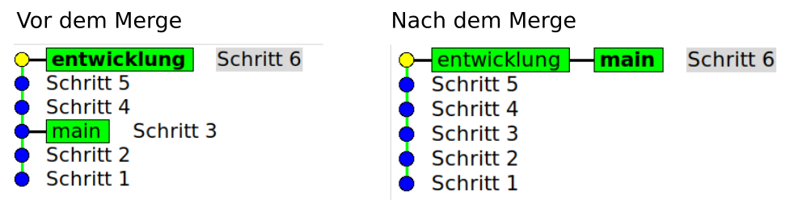
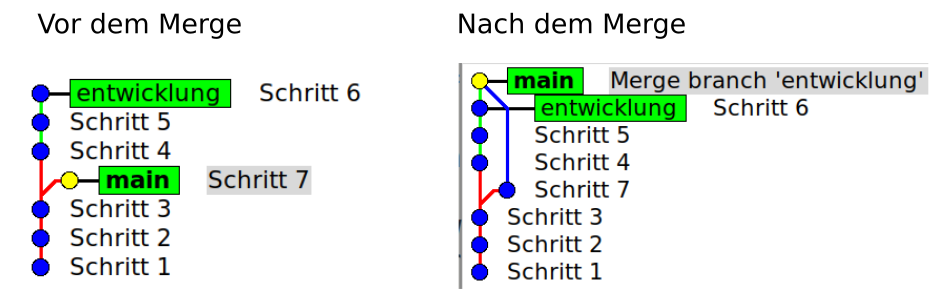

# Fortgeschritten: Merge, Rebase, Squash

Im letzten Abschnitt hast du einfaches Arbeiten 
mit Branches gelernt und wie man sie mit Hilfe eines *Merge* 
zusammengeführt. Das wollen wir uns jetzt genauer ansehen.
Offen geblieben sind folgende Fragen:

* Details zu Merges
* Was passiert mit alten Branches?
* Wie sieht die Alternative zu *Merge* aus?
* Was mache ich mit zu vielen Commits?


## Verschiedene Merges
In der Praxis treten^[Bei mir] meist zwei Fälle auf, da ich 
in der Regel alleine entwickle:

* Während ich am Entwicklungs-Branch arbeite, 
  passiert auf dem Auslieferungsbranch (hier *main*) nichts.
* Ich entwickle an einem völlig anderen Feature,
  das den *main*-Branch gar nicht betrifft.
  Weil das oft aus Zeitgründen länger dauert, kann
  es im *main*-Branch Änderungen geben, die im
  Entwicklungsbranch nicht interessieren.

### Fast-Forward 
Befindest du dich auf dem (unveränderten) *main*-Branch
und holst den Entwicklungsbranch mit Merge, so wird dieser  
einfach vor den letzten Commit des *main*-Branch gesetzt. 
In dieser Situation wird der Branch im Diagramm nicht 
einmal als visuelle Abzweigung dargestellt:

{width=16cm}

Erkennbar sind die grünen Rechtecke, die
die Enden der Branches kennzeichnen.
Im Bild links sind die Branches getrennt, 
im Bild rechts sind beide Branch-Enden nach 
dem Merge an der gleichen Stelle.  
Wie du siehst, hat sich beim Merge die 
Anzahl Commits nicht verändert.

### Drei-Wege Merge
Wenn sich der *main*-Branch parallel
zum Entwicklungsbranch weiterentwickelt,
sieht die Sitation ganz anders aus!



Du siehst, dass sich der *main*-Branch 
zu *Schritt 7* weiterentwickelt hat (neuer Commit). 
Beim Merge entsteht ein neuer Commit, der 
die Spitze beider Branches darstellt.
Du erkennst auch, dass im Diagramm 
die grünen Spitzen der Branches nicht
am gleichen Commit sitzen!

Durch \cmd{git log --oneline --decorate --graph} 
(merken als „git log dog“) wird diese Sitation
auch passend dargestellt:

```bash
*   70c1b21 (HEAD -> main) Merge branch 'entwicklung' into main
|\  
| * 4a6e3a5 (entwicklung) Schritt 6
| * edaeaff Schritt 5
| * 508019b Schritt 4
* | 2ff4a45 Schritt 7
|/  
* 29d2bd4 Schritt 3
* 964ee6f Schritt 2
* 66dcd4f Schritt 1
```

(Welcher Branch (main oder entwicklung) als Abzweigung erscheint, entscheidet die jeweilige Git-Software abhängig von der aktuellen
Situation!)

## Alte Branches
Die Commits eines Branches stellen eine Dokumentation 
des Projektverlaufs dar, die für das Verständnis der
erfolgten Änderungen eventuell notwendig ist. 
Zu viele Branches und Commits erschweren auf der anderen 
Seite den Überblick. 

Es geht also darum, alte Branches zu löschen, 
die *wichtigen* Commits aber zu behalten. 
Für den schulischen Kontext ist das aber weniger relevant.

Um einen lokalen Branch zu löschen, gibt es 
folgenden Befehl:

```bash
git branch -d <name>
```

Er scheitert aber, wenn \git den Branch noch nicht 
als abgeschlossen betrachtet.

Probieren wir das beim letzten Szenario aus. 
Sieh dir die Abbildung oben noch einmal an und
dann lösche den Branch

```bash
git branch -d entwicklung 
```

Du siehst eine minimale Änderung

```bash
*   70c1b21 (HEAD -> main) Merge branch 'entwicklung' into main
|\  
| * 4a6e3a5 Schritt 6   <<< hier fehlt (entwicklung)
| * edaeaff Schritt 5
| * 508019b Schritt 4
* | 2ff4a45 Schritt 7
|/  
* 29d2bd4 Schritt 3
* 964ee6f Schritt 2
* 66dcd4f Schritt 1
```
Das *Etikett* vom Entwicklungsbranch wurde gelöscht,
die Commits bleiben aber in exakt der gleichen 
Anordnung erhalten! Der Branch ist nicht mehr über seinen 
Namen zugänglich, die History ist aber weiterhin vorhanden,
d.h. ein *checkout* der Commits ist immer noch möglich.

Anders ist das allerdings, wenn du einen Branch löschst, der 
*nicht* in einen Merge verwickelt ist. Er existiert dann 
zwar anscheinend weiter, wird aber nach einier Zeit vom 
Garbage-Collector (GC) von \git endgültig entfernt.
(Der Zeitrahmen ist einstellbar). Im Prinzip passiert 
das mit allen Commits, die nicht nicht mehr *erreichbar* sind.

**Beispiel**

```bash
A - B - C - D  <-- main 
      \ E - F - G  <-- feature
```

Wir der Branch *feature* gelöscht, dann wird der Pointer auf G 
entfernt:

```bash
A - B - C - D  <-- main 
      \ E - F - G 
```

Da jeder Commit nur seinen Vorgänger kennt, kommst du zwar 
von D nach A, aber nicht *rückwärts* nach E, F oder G.

## Rebase

Neben dem *Merge* trifft man auch oft auf den *Rebase* um
Branches zusammenzuführen. Er funktioniert allerdings 
deutlich anders und ist wegen seiner vielfältigen 
Möglichkeiten (z.B. Reihenfolge der Commits ändern, ...)
ein Werkzeug für fortgeschrittene Benutzer. Mit seiner 
Hilfe können auch mehrere Commits zusammengefasst werden, 
um die Branches zu verkürzen. Gerade bei der Zusammenarbeit 
im Team kann das aber sehr problematisch werden, wenn 
man nicht ganz genau weiß, was man macht. Das liegt daran, dass
sich die Hashwerte von Commits ändern können und wenn 
sich ein anderer Mitarbeiter den früheren Stand auf den 
eigenen Rechner geholt hat, dann passt nichts mehr zusammen.

https://www.youtube.com/watch?v=CtyLg10aHN0
https://www.youtube.com/watch?v=1TNK-OkaelI


Bei einem Rebase wird der entsprechende Branch 
*verpflanzt* -- d.h. gewissermaßen *ausgerupft* 
und an anderer Stelle wieder *angedockt*.  
Bei diesem Vorgang können die Hashwerte aller 
Commits im Branch geändert.

Betrachte nachfolgendes Script. 
Nach dem ersten Commit wird ein Branch *arbeit* mit mehreren Commits
erstellt und im Anschluss ein Commit wieder im *main*-Branch, 
**der eine andere Datei betrifft**.

```bash 
cd /tmp
rm -rf rebase_lab
git init rebase_lab
cd rebase_lab
git branch -m main

echo "start" >> datei.txt
git add . && git commit -m "Start"

# Branch-Wechsel
git switch -c arbeit

for i in {1..10};do
  echo "inhalt $i" >> datei.txt
  git add . && git commit -m "Inhalt $i"
done

# Branch-Wechsel
git switch main 


echo "Zwischenstopp" >> datei2.txt
git add . && git commit -m "Zwischenstopp"
```


Ziel ist nun ein *rebase* von *arbeit* auf *main*.  

Vor dem Rebase 

```bash
* 0834b9d (arbeit) Inhalt 10
* 4cdd087 Inhalt 9
* ebfa1db Inhalt 8
* d078d5a Inhalt 7
* a65af00 Inhalt 6
* cfb81ab Inhalt 5
* 7fc30db Inhalt 4
* 493cb05 Inhalt 3
* 4648598 Inhalt 2
* cff48d7 Inhalt 1
| * 1af4a22 (HEAD -> main) Zwischenstopp
|/  
* af7e60c Start
```

Nun der Rebase 

```bash
# aktueller Branch ist arbeit
git switch arbeit
git rebase main
git log --oneline --decorate --graph --all

# Ausgabe 
* 43add76 (HEAD -> arbeit) Inhalt 10
* 117f222 Inhalt 9
* 9057374 Inhalt 8
* 71ec034 Inhalt 7
* 66852df Inhalt 6
* f144368 Inhalt 5
* cdba6cf Inhalt 4
* d059b1b Inhalt 3
* d1b3718 Inhalt 2
* c591dc2 Inhalt 1
* 1af4a22 (main) Zwischenstopp << Hash unverändert 
* af7e60c Start                << Hash unverändert 
``` 

Nach dem *rebase* befindet du dich immer noch auf dem Branch *arbeit*
(Siehe HEAD Pointer), die *Abzweigung* nach Start ist verschwunden.
Der Branch \branch{arbeit}
hängt mit seinen Commits und neuen Hashwerten also direkt 
am Commit mit dem Hash 1af4a22 aus dem Branch \branch{main}.

Damit der Rebase aber noch nicht abgeschlossen! Du musst nun
in den *main*-Branch wechseln und einen Merge ausführen

```bash
git switch main 
git merge arbeit 

# Ausgabe 

git merge arbeit 
Aktualisiere 1af4a22..43add76
Fast-forward
 datei.txt | 10 ++++++++++
 1 file changed, 10 insertions(+)
```

Damit ist der HEAD wieder an der korrekten Stelle:

```bash
git log --oneline --decorate --graph --all

# Ausgabe 
* 43add76 (HEAD -> main, arbeit) Inhalt 10
* 117f222 Inhalt 9
* 9057374 Inhalt 8
* 71ec034 Inhalt 7
* 66852df Inhalt 6
* f144368 Inhalt 5
* cdba6cf Inhalt 4
* d059b1b Inhalt 3
* d1b3718 Inhalt 2
* c591dc2 Inhalt 1
* 1af4a22 Zwischenstopp
* af7e60c Start
```

Wie du siehst, ist der Branch *arbeit* aber noch existent!
Lösche ihn mit folgendem Befehl:

```bash
git branch -d arbeit 
git log --oneline --decorate --graph --all

# Ausgabe
* 43add76 (HEAD -> main) Inhalt 10
* 117f222 Inhalt 9
* 9057374 Inhalt 8
* 71ec034 Inhalt 7
* 66852df Inhalt 6
* f144368 Inhalt 5
* cdba6cf Inhalt 4
* d059b1b Inhalt 3
* d1b3718 Inhalt 2
* c591dc2 Inhalt 1
* 1af4a22 Zwischenstopp
* af7e60c Start
```

Damit ist der Rebase komplett beendet und das Repository wieder aufgeräumt.
Das lief so reibungslos, weil der Commit *Zwischenstop* eine andere 
Datei betroffen hat (\datei{datei2.txt}). Hätten Änderungen an \datei{datei.txt}
stattgefunden, so hätten wir einen Konflikt bekommen, den wir hätten lösen müssen.


Führe der Script \datei{rebase_mit_konflikt.sh} aus und versuche 
dann einen Rebase:

```bash
git rebase main 
automatischer Merge von datei.txt
KONFLIKT (Inhalt): Merge-Konflikt in datei.txt
error: Konnte 2f5968f... (Inhalt 1) nicht anwenden
Hinweis: Resolve all conflicts manually, mark them as resolved with
Hinweis: "git add/rm <conflicted_files>", then run "git rebase --continue".
Hinweis: You can instead skip this commit: run "git rebase --skip".
Hinweis: To abort and get back to the state before "git rebase", run "git rebase --abort".
Konnte 2f5968f... (Inhalt 1) nicht anwenden
```

Die Hinweiszeilen beschreiben eigentlich sehr genau, was zu tun ist:

* Konflikt manuell lösen
* \cmd{git add datei.txt}
* \cmd{git rebase --continue} ausführen
* Commit-Nachricht anpassen


### Merge oder Rebase

Bei *merge* kann die History verzweigter aussehen, 
bei *rebase* können sich Commit-Hashes ändern.  

Als Faustregel gilt, dass du die Finger vom Rebase
lassen solltest, wenn irgendwer außer dir Zugriff 
auf den betroffen Branch hat (Team-Arbeit).
Solange du nur auf deinen Rechner arbeitest gibt es 
(außer Konflikten) kein Problem.


## Squash

Squash ist kein eigenständiger Befehl, sondern ein Parameter von 
*rebase*. Angenommen, du hast eine ganze Liste von filigranen
Commits erzeugt, die du im Nachhinein zu einem Commit 
zusammenfassen willst. In diesem Fall führst du einen 
*interaktiven Squash* durch :

```bash
git rebase -i HEAD~3 # 3 Commits, rückwärts von HEAD
git rebase -i <hash> # der älteste Commit zum Squashen
```

Als Reaktion wird dein Editor gestartet, der dir in den 
ersten Zeile die zum Squash verfügbaren Commits anzeigt.
Angenommen, es geht um 3 Commits, dann ersetzt du beim 
allen **bis auf den neuesten** Commits das *pick* durch
ein *s* (für Squash).  
Mit dem Speichern der Datei wird dies durchgeführt und du
bekommst ein neues Editor-Fenster für eine Commit-Message.
Hast du diese gespeichert, ist der Squash beendet.

