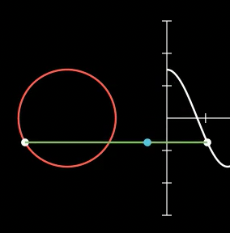

# Fortgeschritten: Merge, Rebase, Squash
Im letzten Abschnitt hast du einfaches Arbeiten 
mit Branches gelernt und wie man sie mit Hilfe eines *Merge* 
zusammengeführt. Das wollen wir uns jetzt genauer ansehen.
Offen geblieben sind aber folgende Fragen:

* Was passiert mit alten Branches?
* Was mache ich mit zu vielen Commits?
* Wie sieht die Alternative zu *Merge* aus?

## Verschiedene Merges
In der Praxis treten^[Bei mir] meist zwei Fälle auf, da ich 
in der Regel alleine entwickle:

* Während ich am Entwicklungs-Branch arbeite, 
  passiert auf dem Auslieferungsbranch (hier *main*) nichts.
* Ich entwickle an einem völlig anderen Feature,
  das den *main*-Branch gar nicht betrifft.
  Weil das oft aus Zeitgründen länger dauert, kann
  es im *main*-Branch Änderungen geben, die im
  Entwicklungsbranch nicht interessieren.

### Fast-Forward 
Befindest du dich auf dem (unveränderten) *main*-Branch
und holst den Entwicklungsbranch mit Merge, so wird dieser  
einfach vor den letzten Commit des *main*-Branch gesetzt. 
In dieser Situation wird der Branch im Diagramm nicht 
einmal als visuelle Abzweigung dargestellt:

{width=16cm}

Erkennbar sind die grünen Rechtecke, die
die Enden der Branches kennzeichnen.
Im Bild links sind die Branches getrennt, 
im Bild rechts sind beide Branch-Enden nach 
dem Merge an der gleichen Stelle.  
Wie du siehst, hat sich beim Merge die 
Anzahl Commits nicht verändert.

### Drei-Wege Merge
Wenn sich der *main*-Branch parallel
zum Entwicklungsbranch weiterentwickelt,
sieht die Sitation ganz anders aus!


Du siehst, dass sich der *main*-Branch 
zu *Schritt 7* weiterentwickelt hat (neuer Commit). 
Beim Merge entsteht ein neuer Commit, der 
die Spitze beider Branches darstellt.
Du erkennst auch, dass im Diagramm 
die grünen Spitzen der Branches nicht
am gleichen Commit sitzen!

Durch \cmd{git log --oneline --decorate --graph} 
(merken als „git log dog“) wird diese Sitation
auch passend dargestellt:

```bash
*   70c1b21 (HEAD -> main) Merge branch 'entwicklung' into main
|\  
| * 4a6e3a5 (entwicklung) Schritt 6
| * edaeaff Schritt 5
| * 508019b Schritt 4
* | 2ff4a45 Schritt 7
|/  
* 29d2bd4 Schritt 3
* 964ee6f Schritt 2
* 66dcd4f Schritt 1
```

(Welcher Branch (main oder entwicklung) als Abzweigung erscheint, entscheidet die jeweilige Git-Software abhängig von der aktuellen
Situation!)

## Alte Branches
Die Commits eines Branches stellen eine Dokumentation 
des Projektverlaufs dar, die für das Verständnis der
erfolgten Änderungen eventuell notwendig ist. 
Zu viele Branches und Commits erschweren auf der anderen 
Seite den Überblick. 

Es geht also darum, alte Branches zu löschen, 
die *wichtigen* Commits aber zu behalten. 
Für den schulischen Kontext ist das aber weniger relevant.

Um einen lokalen Branch zu löschen, gibt es 
folgenden Befehl:

```bash
git branch -d <name>
```

Er scheitert aber, wenn \git den Branch noch nicht 
als abgeschlossen betrachtet.

Probieren wir das beim letzten Szenario aus. 
Sieh dir die Abbildung oben noch einmal an und
dann lösche den Branch

```bash
git branch -d entwicklung 
```

Du siehst eine minimale Änderung

```bash
*   70c1b21 (HEAD -> main) Merge branch 'entwicklung' into main
|\  
| * 4a6e3a5 Schritt 6   <<< hier fehlt (entwicklung)
| * edaeaff Schritt 5
| * 508019b Schritt 4
* | 2ff4a45 Schritt 7
|/  
* 29d2bd4 Schritt 3
* 964ee6f Schritt 2
* 66dcd4f Schritt 1
```
Das *Etikett* vom Entwicklungsbranch wurde gelöscht,
die Commits bleiben aber in exakt der gleichen 
Anordnung erhalten! Der Branch ist nicht mehr über seinen 
Namen zugänglich, die History ist aber weiterhin vorhanden,
d.h. ein *checkout* der Commits ist immer noch möglich.


## Rebase

Neben dem *Merge* trifft man auch oft auf den *Rebase* um
Branches zusammenzuführen. Er funktioniert allerdings 
deutlich anders und ist wegen seiner vielfältigen 
Möglichkeiten (z.B. Reihenfolge der Commits ändern, ...)
ein Werkzeug für fortgeschrittene Benutzer. Mit seiner 
Hilfe können auch mehrere Commits zusammengefasst werden, 
um die Branches zu verkürzen. Gerade bei der Zusammenarbeit 
im Team kann das aber sehr problematisch werden, wenn 
man nicht ganz genau weiß, was man macht. Das liegt daran, dass
sich die Hashwerte von Commits ändern können und wenn 
sich ein anderer Mitarbeiter den früheren Stand auf den 
eigenen Rechner geholt hat, dann passt nichts mehr zusammen.

https://www.youtube.com/watch?v=CtyLg10aHN0
https://www.youtube.com/watch?v=1TNK-OkaelI



Bei einem Rebase wird der entsprechende Branch 
*verpflanzt* -- d.h. gewissermaßen *ausgerupft* 
und an anderer Stelle wieder *angedockt*.  
Bei diesem Vorgang werden die Hashwerte aller 
Commits im Branch geändert.

```bash
* 10f8d8d (HEAD -> arbeit) Neuer Inhalt 10
* e0ae3ce Neuer Inhalt 9
* 1eac6f3 Neuer Inhalt 8
* fa76537 Neuer Inhalt 7
* da22859 Neuer Inhalt 6
* 7903aaf Neuer Inhalt 5
* 33428f1 Neuer Inhalt 4
* 80db22a Neuer Inhalt 3
* 4a642a8 Neuer Inhalt 2
* a3645f3 Neuer Inhalt 1
| * 2c58be7 (main) Zwischenstopp
|/  
* 7fea00c Start
```

Du siehst einen Branch \branch{arbeit} mit mehreren Commits
und einen einzigen Commit im \branch{main}-Branch (Zwischenstopp).

Wenn du nun vom Branch \branch{arbeit} aus einen Rebase 
auf den Branch \branch{main} ausführst:

```bash
git switch arbeit 
git rebase main 
```

dann sieht das Ergebnis so aus:

```bash
* 1cad272 (HEAD -> arbeit) Neuer Inhalt 10
* 130c5b0 Neuer Inhalt 9
* 5b84ab1 Neuer Inhalt 8
* 56d74ea Neuer Inhalt 7
* 9255c1d Neuer Inhalt 6
* 412fa37 Neuer Inhalt 5
* cb91e55 Neuer Inhalt 4
* 3ab37b7 Neuer Inhalt 3
* dc4b1b0 Neuer Inhalt 2
* 9591035 Neuer Inhalt 1
* 2c58be7 (main) Zwischenstopp
* 7fea00c Start
```

Die Verzweigung ist verschwunden und der Branch \branch{arbeit}
hängt mit seinen Commits und neuen Hashwerten  
am Commit mit dem Hash 2c58be7 aus dem Branch \branch{main}.

Auch wenn es nicht so wirkt: Der Branch \branch{arbeit} 
ist immer noch vorhanden! Das kannst du auch einfach
testen, indem du auf den \branch{main}-Branch und das 
Log betrachtest -- es sind immer noch zwei Commits! 
Du kannst im Main auch einen wechselst
und dort einen neuen Commit erstellst:

```bash
git switch main 
echo "kontrolle" > kontrolle.txt 
git add kontrolle.txt 
git commit -m "Kontrolle"
```

Das Log zeigt dann

```bash
* 3508cce (HEAD -> main) Kontrolle 
| * 1cad272 (arbeit) Neuer Inhalt 10
....
| * dc4b1b0 Neuer Inhalt 2
| * 9591035 Neuer Inhalt 1
|/  
* 2c58be7 Zwischenstopp
* 7fea00c Start
```

Die Branches laufen also wieder auseinander.
Möchtest du den Branch \branch{arbeit} loswerden,
dann würdest du hier eher den Rebase von \branch{main}
auf \branch{arbeit} ausführen. \git versucht dann, 
den \branch{main}-Branch hinter den Branch \branch{arbeit}
zu hängen. Aus dieser Situation heraus kannst du dann 
auch den Branch \branch{arbeit} löschen:

```bash
git branch -d arbeit 
```

Es ist aber unrealistische, derartige Szenarien wirklich 
im Unterricht nachzuspielen.

## Squash

Squash ist kein eigenständiger Befehl, sondern ein Parameter von 
*rebase*. Angenommen, du hast eine ganze Liste von filigranen
Commits erzeugt, die du im Nachhinein zu einem Commit 
zusammenfassen willst. In diesem Fall führst du einen 
*interaktiven Squash* durch :

```bash
git rebase -i HEAD~3 # 3 Commits, rückwärts von HEAD
git rebase -i <hash> # der älteste Commit zum Squashen
```

Als Reaktion wird dein Editor gestartet, der dir in den 
ersten Zeile die zum Squash verfügbaren Commits anzeigt.
Angenommen, es geht um 3 Commits, dann ersetzt du beim 
allen **bis auf den neuesten** Commits das *pick* durch
ein *s* (für Squash).  
Mit dem Speichern der Datei wird dies durchgeführt und du
bekommst ein neues Editor-Fenster für eine Commit-Message.
Hast du diese gespeichert, ist der Squash beendet.

