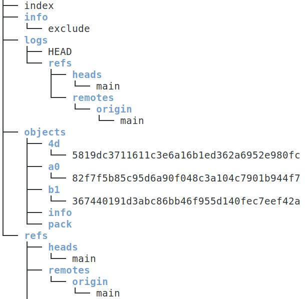
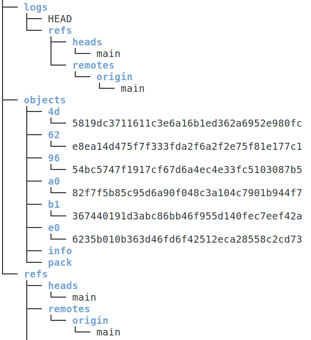

# Arbeiten im Team
## Herausforderungen
Das Arbeiten im Team stellt dich vor zwei Probleme:

* Welche Server-Infrastruktur sollst du verwenden?
* Was ändert sich am Workflow in \git 

Beide Punkte sollen nachfolgend besprochen werden, 
wobei es zwangsläufig Überschneidungen geben wird.

### Infrastruktur
Im Kern ist es egal ob wir vom Setup im Klassenzimmer
oder im Internet sprechen -- auch wenn ein Netzwerk beteiligt ist, 
so bleibt die Basistechnik der letzten Kapitel gleich. Neu sind 
allerdings Aspekte der Sicherheit (Zugriff) und der Logistik
beim Datenabgleich zwischen mehreren Repositories.

Für eine server-basierende Teamarbeit gibt es folgende Varianten
(selbst gehostet oder kommerziell):

* einfacher \git-Server  
  Die Installation ist einfach, die Grundkonfiguration auch.
  Der Zugriff erfolgt über ssh. Soll das ohne Kennwort 
  funktionieren, so müssen Schlüssel erzeugt und auf dem Server 
  eingepflegt werden. Später führt um die Schlüssel aber 
  ohnehin kein Weg herum.

* \git-Server mit kennwortlosem Zugriff über http.  
  Funktioniert, ist aber keinesfalls für den Live-Einsatz 
  über einen längeren Zeitraum im Internet zu empfehlen.
  
* Ein \git-Server mit *Gitea*  
  Gui-basiertes System mit vielen Optionen und weniger komplex als 
  *GitLab* 

* Ein \git-Server mit *GitLab* 

* Ein bezahlter DSGVO-Konformer Anbieter

* Gemeinnützige Organisationen wie *codeberg.org* (kein CICD(?) )

### Änderungen am Workflow
Bei der Arbeit im Team ändert sich im Vergleich zum 
lokalen Arbeiten zunächst wenig. Die
Befehle *branch, add, commit, ...* 
funktionieren genau wie bisher. Neu sind 
allerdings die folgenden Schritte

* Initiales Holen des Repos auf den eigenen Rechner (=clone)
* Regelmäßiges Abrufen des aktuellen Standes (=pull)
* Veröffentlichen des eigenen Standes (=push)

Hierbei sind einige Spielregeln zu beachten, damit es nicht
zu Problemen kommt. Diese Regeln werden meist als Workflow
oder im Speziellen auch als GitFlow bezeichnet. Es gibt hier 
zwar gewisse -- aber keinesfalls verbindliche -- Standards.
Jede Firma stellt für \git ihre eigenen, fest vorgeschriebenenen
Abläufe auf, an die sich die Mitarbeiter zu halten haben.

### Mögliche Vereinbarungen
Auch die folgenden Vereinbarungen sind nur exemplarisch zu sehen und 
können in jeder Firma oder jedem Projekt anders umgesetzt werden!

**Verantwortung**  
Im Projekt gibt es einen Branch \branch{main}, der aber durch 
entsprechende Maßnahmen für *einfache* Mitarbeiter 
schreibgeschützt ist. Änderungen dürfen nur nach 
gründlichen Tests und Code-Reviews in diesen Zweig 
aufgenommen werden. In der Regel gilt hier auch ein 
*Mehr-Augen-Prinzip* oder noch weiter gestaffelte 
Zuständigkeitshierarchien.  

**Arbeitsbranch**  
Je nach Größe des Projekt-Teams gibt es einen oder mehrere
\branch{development}-Branches. Die Mitarbeiter holen sich 
diesen Zweig und lassen von ihm ihre eigenen Arbeitszweige
(Feature-Branches, Bugfix-Branches) ausgehen. Ist ihre 
Arbeit dort beendet, muss der Code getestet werden und dann 
erst erfolgt der Merge in den \branch{development}-Branch.

#### Etwas mehr Details
Da im Team mehrere Personen zu unvorhersehbaren Zeitpunkten 
Änderungen am Code vornehmen, muss jeder
Mitarbeiter dafür sorgen, dass er immer die aktuellste Version 
vorliegen hat. Da er seine Entwicklung aber in seinem 
eigenen \branch{Feature}-Branch vorantreibt, müssen 
diese Änderungen der Kollegen dort aber erst ankommen -- dies geschieht
durch regelmäßige Merges der fremden Arbeit **in** den eigenen
Branch.

**Beispiel**  

Aus Platzgründen zeichne ich das Branch-Diagramm hier
waagrecht. Man sieht, dass beim Commit $m_2$  der 
\branch{devlopment}-Branch abzweigt und dann vom Commit $d_1$ 
sofort der \branch{feature}-Branch.  
Ab jetzt werden regelmäßig Änderungen am \branch{development}-Branch
auf den eigenen \branch{feature}-Branch gezogen, um so immer 
den aktuellen Stand zu haben. Diese Änderungen am \branch{development}-Branch
können von den Teamkollegen stammen.



Merges in die andere Richtung -- also vom \branch{feature}- auf
den \branch{development}-Branch sieht man im Bild oben noch keine. Auch der
\branch{main}-Branch wurde noch nie aktualisiert.

#### Pull und fetch

Die Grundidee von *holen* und *veröffentlichen* ist 
relativ einfach und eventuell muss man den Schülern 
auch nicht mehr erzählen. Da aber Code von anderen 
Entwicklern auf deinen Rechner kommt, solltest du 
diesen eventuell nicht ungesehen in deine Entwicklung
aufnehmen. Der Befehl \cmd{git pull} macht aber genau das.  
Willst du an dieser Stelle sicher gehen, so führst
du zuerst \cmd{git fetch} aus und siehst dir die Änderungen 
an -- siehe weiter unten. Im Anschluss kannst du
sie dann mit \cmd{git merge} übernehmen.

**Wo sind die Dateien?**  
Was am Anfang sehr geheimnisvoll ist, betrifft den Speicherort der 
Dateien, die mit \cmd{git fetch} geholt wurden. Natürlich müssen sie 
in irgendeiner Weise im Ordner \ordner{.git} abgelegt sein, aber wie 
sieht das aus?

Dafür brauchen wir nun einen etwas *klobigeren* Setup, bestehend aus

* einem Server-Repository
* einem lokalen Repository (Kollege 1)
* einem lokalen Repository (Kollege 1)

Wir können das aber problemlos auf dem eigenen Rechner simulieren!

```bash
set -x
cd /tmp
rm -rf fetch_lab
mkdir fetch_lab
cd fetch_lab 

git init --bare server.git 
cd server.git 
git branch -m main 

cd ..
git clone ./server.git kollege_1
git clone ./server.git kollege_2
```

Unser Ordner sieht nun so aus:

```bash
ls 

# Ausgabe
kollege_1  kollege_2  server.git
```

Nun erstellt Kollege 1 eine Datei und pusht sie ins Server-Repository.
Beachte, dass der Autor hier nicht aussagekräftig ist, weil wir das 
ja als globale Einstellung für \git festgelegt haben!

```bash
cd kollege_1 
echo "Zeile 1" > datei.txt 
git add . && git commit -m "Inhalt von Kollege 1"
git push 
cd ..

# Ausgabe
[main (Root-Commit) a082f7f] Inhalt von Kollege 1
 1 file changed, 1 insertion(+)
 create mode 100644 datei.txt
Objekte aufzählen: 3, fertig.
Zähle Objekte: 100% (3/3), fertig.
Schreibe Objekte: 100% (3/3), 227 Bytes | 227.00 KiB/s, fertig.
Gesamt 3 (Delta 0), Wiederverwendet 0 (Delta 0), Pack wiederverwendet 0
To /tmp/fetch_lab/./server.git
 * [new branch]      main -> main
```

Kollege 2 kann diesen Stand nun abholen:

```bash
cd kollege_2
git pull

# Ausgabe 
remote: Objekte aufzählen: 3, fertig.
remote: Zähle Objekte: 100% (3/3), fertig.
remote: Gesamt 3 (Delta 0), Wiederverwendet 0 (Delta 0), Pack wiederverwendet 0
Entpacke Objekte: 100% (3/3), 207 Bytes | 207.00 KiB/s, fertig.
Von /tmp/fetch_lab/./server
 * [neuer Branch]    main       -> origin/main
```

Die Datei ist nun angekommen und kann verändert werden:

```bash
echo "Zeile 2 von Kollege 2" >> datei.txt
git add .
git commit -m "Änderung"

# Ausgabe 
[main 9654bc5] Änderung
 1 file changed, 1 insertion(+), 1 deletion(-)
```

Nun kommen die Änderungen auf den Server

```bash
git push
cd ..

# Ausgabe
Objekte aufzählen: 5, fertig.
Zähle Objekte: 100% (5/5), fertig.
Schreibe Objekte: 100% (3/3), 265 Bytes | 265.00 KiB/s, fertig.
Gesamt 3 (Delta 0), Wiederverwendet 0 (Delta 0), Pack wiederverwendet 0
To /tmp/fetch_lab/./server.git
   a082f7f..9654bc5  main -> main
```

Bevor Kollege 1 nun einen *fetch* ausführt, werfen wir einen Blick in 
seinen \git-Ordner:

```bash
cd kollege_1 
tree .git 
```
\bcenter
{width=7cm}
\ecenter

Nun führt er einen *fetch* aus:

\blarge
```bash
git fetch 

# Ausgabe
remote: Objekte aufzählen: 5, fertig.
remote: Zähle Objekte: 100% (5/5), fertig.
remote: Gesamt 3 (Delta 0), Wiederverwendet 0 (Delta 0), Pack wiederverwendet 0
Entpacke Objekte: 100% (3/3), 245 Bytes | 245.00 KiB/s, fertig.
Von /tmp/fetch_lab/./server
   a082f7f..9654bc5  main       -> origin/main
```
\elarge

\bcenter
{width=7cm}
\ecenter

Es sind also drei \git-Objekte dazu gekommen. Das sind die Änderungen von Kollege 2,
die noch nicht in die Arbeit von Kollege 1 übernommen wurden. 

Das kann man im Log auch schön sehen:

```bash
git log --all --oneline 

# Ausgabe
9654bc5 (origin/main) Änderung
a082f7f (HEAD -> main) Inhalt von Kollege 1
```

Um die Änderungen auch zu sehen, gibt es wieder *diff*:

```bash
git diff a082f7f  9654bc5

# Ausgabe
diff --git a/datei.txt b/datei.txt
index b136744..62e8ea1 100644
--- a/datei.txt
+++ b/datei.txt
@@ -1 +1 @@
-Zeile 1
+Zeile 2 von Kollege 2
```

Findet die Änderung Gefallen, so kann Kollege 1 sie mit 
\cmd{git merge} in seine Arbeit übernehmen. Falls er sich nicht sicher 
ist, wäre ein Branch an dieser Stelle eine Alternative. Der Befehl dafür 
hätte gelautet: \cmd{git switch -c abchecken origin/main}. Hier kann er 
nun die Änderungen auch testen und falls alles passt in \branch{main}
wieder \cmd{git merge} aufrufen.

#### Was kann schief gehen?

Angenommen, beide Kollegen arbeiten fleißig und ändern Dinge in ihrem 
Repository. Dann können wir 2 Fälle unterscheiden:

* Arbeit an verschiedenen Dateien
* Arbeit an der gleichen Datei

Wir wollen das in dieser Reihenfolge durchspielen.

\blarge
```bash
cd kollege_1 
echo "Datei von Kollege 1" > koll_1_datei.txt 
git add .
git commit -m "Neue Datei koll 1"
git push
cd ..

# Ausgabe 
[main 7b493ff] Neue Datei koll 1
 1 file changed, 1 insertion(+)
 create mode 100644 koll_1_datei.txt
Objekte aufzählen: 4, fertig.
Zähle Objekte: 100% (4/4), fertig.
Delta-Kompression verwendet bis zu 6 Threads.
Komprimiere Objekte: 100% (2/2), fertig.
Schreibe Objekte: 100% (3/3), 304 Bytes | 304.00 KiB/s, fertig.
Gesamt 3 (Delta 0), Wiederverwendet 0 (Delta 0), Pack wiederverwendet 0
To /tmp/fetch_lab/./server.git
   9d502b1..7b493ff  main -> main
```
\elarge

Kollege 2 macht die gleiche Aktion auf einer anderen Datei

\bxlarge
```bash
cd kollege_2 
echo "Datei von Kollege 2" > koll_2_datei.txt 
git add .
git commit -m "Neue Datei koll 2"
git push

# Ausgabe 

[main b3ca883] Neue Datei koll 2
 1 file changed, 1 insertion(+)
 create mode 100644 koll_2_datei.txt
To /tmp/fetch_lab/./server.git
 ! [rejected]        main -> main (fetch first)
error: Fehler beim Versenden einiger Referenzen nach '/tmp/fetch_lab/./server.git'
Hinweis: Updates were rejected because the remote contains work that you do not
Hinweis: have locally. This is usually caused by another repository pushing to
Hinweis: the same ref. If you want to integrate the remote changes, use
Hinweis: 'git pull' before pushing again.
Hinweis: See the 'Note about fast-forwards' in 'git push --help' for details.
```
\exlarge

\Git weigert sich also, weil die Änderungen von Kollege 1 noch nicht *abgeholt* wurden.
Es ist demnach sinnvoll, vor jedem *push* (und auch bei Arbeitsbeginn) zunächst einen *pull*
auszuführen. Es kann aber noch komplexer werden:

\bxlarge
```bash
git pull 

# Ausgabe
remote: Objekte aufzählen: 4, fertig.
remote: Zähle Objekte: 100% (4/4), fertig.
remote: Komprimiere Objekte: 100% (2/2), fertig.
remote: Gesamt 3 (Delta 0), Wiederverwendet 0 (Delta 0), Pack wiederverwendet 0
Entpacke Objekte: 100% (3/3), 284 Bytes | 142.00 KiB/s, fertig.
Von /tmp/fetch_lab/./server
   9d502b1..7b493ff  main       -> origin/main
Hinweis: Sie haben abweichende Branches und müssen angeben, wie mit diesen
Hinweis: umgegangen werden soll.
Hinweis: Sie können dies tun, indem Sie einen der folgenden Befehle vor dem
Hinweis: nächsten Pull ausführen:
Hinweis: 
Hinweis:   git config pull.rebase false  # Merge
Hinweis:   git config pull.rebase true   # Rebase
Hinweis:   git config pull.ff only       # ausschließlich Vorspulen
Hinweis: 
Hinweis: Sie können statt "git config" auch "git config --global" nutzen, um
Hinweis: einen Standard für alle Repositories festzulegen. Sie können auch die
Hinweis: Option --rebase, --no-rebase oder --ff-only auf der Kommandozeile nutzen,
Hinweis: um das konfigurierte Standardverhalten pro Aufruf zu überschreiben.
fatal: Es muss angegeben werden, wie mit abweichenden Branches umgegangen werden sollen.
```
\exlarge

Das sieht nun sehr bedrohlich aus ... was ist passiert?  

Betrachten wir die Situation der Kollegen im Detail, **bevor** das passiert ist.
Dafür solltest du das Script \datei{material/git\_core/team\_hands\_on/kollegen.sh} laufen lassen.

```{.bash include="src/11_team_hands_on/kollegen.sh"}
```

Aktueller Stand nach dem Script:

Kollege 1
```bash
cd kollege_1 
git log --oneline --graph --all --decorate

# Ausgabe
* 7658af2 (HEAD -> main) Neue Datei koll 1
* b34f432 (origin/main) Änderung
* 3a1b032 Inhalt von Kollege 1
```

Kollege 2
```bash
cd ../kollege_2
git log --oneline --graph --all --decorate

# Ausgabe
* 493aad8 (HEAD -> main) Neue Datei koll 2
* b34f432 (origin/main) Änderung
* 3a1b032 Inhalt von Kollege 1
```

Beide haben den Commit mit dem Hash `b34f432`, der den Stand auf dem Server darstellt.
Danach haben sie beide weiter gemacht und an diesen Commit einen neuen Commit gehängt.
Diese Commits haben nun unterschiedliche Hashes. \Git steht also vor dem Problem, was es 
in dieser Situation machen soll. Es ist nicht möglich, die History mit 2 *Köpfen* fortzuführen.
Die beiden Commits müssen zusammengeführt werden und dafür gibt es eben 3 Möglichkeiten

* Nie Rebase  (= Merge)
* Immer Rebase (= Rebase)
* Nur Fast Forward 

Dem typischen *pull* von \git entspricht am ehesten die erste Variante -- deshalb sollte sie 
auch eingestellt werden (außer man weiß genau, was man macht)

Nach dem üblichen Editor-Fenster zum erstellen einer Commit-Message werden die beiden 
Zweige von Kollege 1 und Kollege 2 zusammengeführt und Kollege 2 kann einen *push* ausführen. 

### Einige Fragen zu push und pull

**Wie kann ich einen neuen Branch pushen?**

```bash
# auf dem Client
git switch -c arbeit 
git push -u origin arbeit  
```

\samplestart
**Hinweis**  
Du hast nun mehrfach *origin main* aber auch *origin/main* 
gesehen. Was ist der Unterschied? Die erste Variante sind Argumente
für die \git-Befehle. *Origin* ist die Adresse des Servers, *main* ist 
der betroffene Branch.  
Bei der zweiten Variante handelt es sich um eine Referenz auf dem 
Client, die den Branch auf dem Server beschreibt.  
\sampleend


**Ist es egal, in welchem Branch ich fetch/pull/push ausführe?**  
Jein.  
Beim Pushen kann nicht viel schief gehen. Upstream-Branches laufen 
automatisch und wenn sie nicht als upstream konfiguriert sind, 
dann geht der Push (standardmäßig) nicht.  

Ein \cmd{git pull} holt sich auch immer den Inhalt des aktuellen 
Branches (sofern er auf dem Server existiert).

Gefährlicher ist es, wenn du zum Beispiel im Branch \branch{arbeit} bist 
ein \cmd{git pull versuche} ausführst. In diesem Fall wird der falsche Branch 
geholt in deinen hinein gemerged.

