# Serveinstallation I

## Proxmox

Für diese Workshop -- und auch im schulischen Umfeld -- wird 
für \git ein richtiger Server benötigt. Entweder du mietest 
einen LinuxServer im Internet bei einem der typischen Anbieter
wie Strato, Contabo, ... oder du installierst auf einem eigenen 
Computer Proxmox. Dabei handelt es sich um eine kostenlose 
Virtualisierungsplattform. Die nachfolgenden Schritte beschreiben 
lediglich eine Basisiinstallation! Für komplexere Szenarien führt 
an einer tieferen Beschäftigung ohnehin kein Weg vorbei.

Die Anforderungen an den Rechner sind nach heutigen Maßstäben 
eher moderat. Ein Mehrkernprozessor und mindestens 4GB RAM sind 
sinnvoll. Eigene kleine Versuche genügt auch weniger, aber mit dem 
RAM kann es dann knapp werden.

Verwaltet wird der Server später dann nur noch über Weboberfläche.
ein direkter Zugang zu einer GUI ist über den eigentlichen Bildschirm 
dann nicht mehr möglich/sinnvoll. Du benötigst also noch ein weiteres Gerät (Laptop, ...).

\begin{tcolorbox}[title=WARNUNG]
Auf dem Computer werden bei der Installation sämtliche Daten gelöscht!!!
\end{tcolorbox}

### Installation
Proxmox kann als Image aus dem Internet (proxmox.com) geladen werden 
und muss dann zu einem bootfähigen USB-Stick gemacht werden. 
Unter Windows gibt es dafür einige Tools, wie zum Beispiel Rufus. 
Wie so oft geht es unter Linux einfacher:

```bash
dd if=imagename.iso of=/dev/usb0 bs=2048k
```

Wie ein Computer von USB gestartet werden kann, ist so unterschiedlich, 
dass man nur auf die Dokumentation oder das Internet verweisen kann.
Im Regelfall führt das Drücken einer bestimmten Funktionstaste (Lenovo gerne F12) zum richtigen Zeitpunkt (wiederholtes Drücken nach dem Einschalten bis etwas passiert) in ein Setup oder Bootmenü.

Nach dem Auswählen des USB-Sticks erfolgt dann der Start ins Installationsmenü von Proxmox. 

Die einzugebenden Daten (Kennwort, IP-Adresse, Gateway, ...) sind so 
selbsterklärend, dass eine Bilderstrecke hier reine Platzverschwendung wäre.

### Installation Ubuntu

Als Vorbereitung muss das aktuelle *Ubuntu LTS 24.04* als iso-Image heruntergeladen werden. Das **kann** bereits auf dem Proxmox gemacht werden, **falls** man die exakte URL für den Download kennt.  
Andernfalls lädst du das Image auf dein Endgerät und machst dann einen 
Upload auf den Proxmox. Keine Angst -- Details kommen sofort!

**Proxmox aufrufen**  

* Gehe im Browser auf die Seite `<proxmox-ip>:8006` 
* Akzeptiere das Risiko wegen des fehlenden Zertifikats
* Gib als Benutzer *root* und das festgelegte Kennwort ein.
* Ignoriere die Warnung wegen der fehlenden Lizenz  
  (Im Internet gibt es -- offizielle -- Anleitunge, wie du diese 
   Warnung entfernen kannst.)

Auf der Weboberfläche gibt es unendliche viele Einstellungsmöglichkeiten.
Wir beschränken uns auf die wichtigsten Aspekte für die Installation von 
Ubuntu.  
Am linken Rand befindet sich ein Menü, in dem die *Perspektive* auf den Server eingestellt werden kann -- eher logisch, eher speicherorientiert, ... . Im mittleren Bereich wird die eigentliche 
Konfiguration erfolgen.

\bcenter
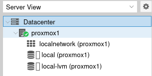{width=3cm}
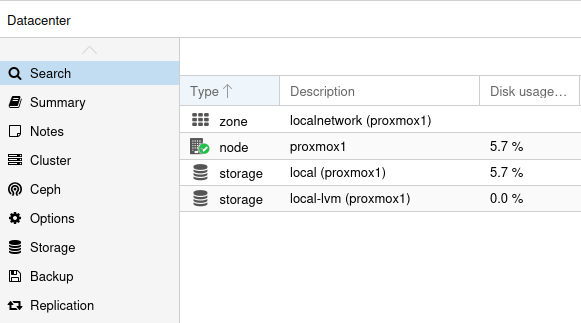{width=10cm}
\ecenter

Am linken Rand sind 2 Speicherbereiche zu erkennen:

* local
* local-lvm

Die Platte wurde also in zwei Bereiche unterteilt. Im *local* Bereich 
werden z.B. die heruntergeladenen Images für die Installation aufbewahrt,
im LVM-Bereich (Logical Volume Manager) können weitere Speichermedien nahtlos eingebunden werden -- also nicht als *Laufwerk K* sondern so, als wäre dieses Laufwerk jetzt einfach größer. Unter Windows gab (gibt?) es das als DFS (Distributed File System). Hier werden die die installierten 
Systeme gespeichert. Hier können sie später auch noch wachsen, weil ausreichend Platz ist.

**Ubuntu hochladen/herunterladen**  

Ein direkter Download von Ubuntu über die URL ist etwas versteckt unter folgender Adresse zu finden:

    releases.ubuntu.com 
    
Wir verwenden aktuell Version 24.04.4.
Das ist eine LTS-Version (Long Term Support) mit Updates bis 2029.

* Wähle in der linken Spalte *local*
* Wähle in der Mitte *iso-Images*
* Button *Download from URL*
* Füge die URL ein
* Klicke auf *Query URL*
* Klicke auf Download
* Warte ...

`https://releases.ubuntu.com/24.04.4/ubuntu-24.04.4-live-server-amd64.iso` 

Nach dem Download schließt du das Fenster einfach wieder.

**Neue Virtuelle Maschine (VM) erstellen**  

Klicke oben rechts auf *Create VM*.  

Es folgt ein mehrseitiger Dialog, der bereits großteils sinnvoll vorbelegt ist:

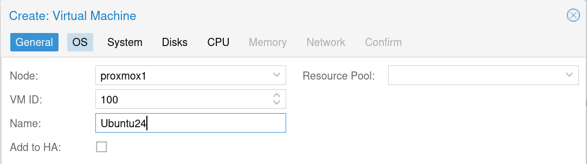

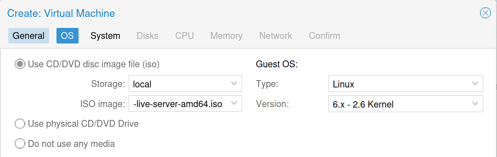

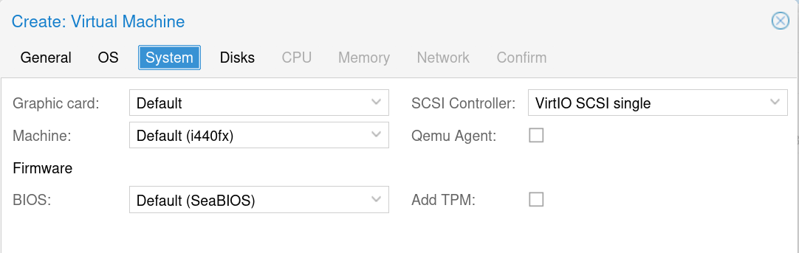

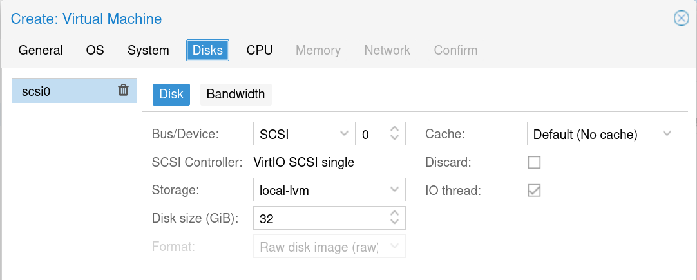

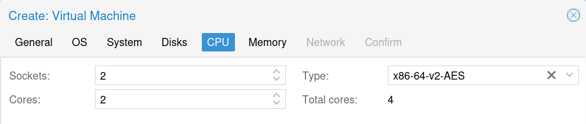

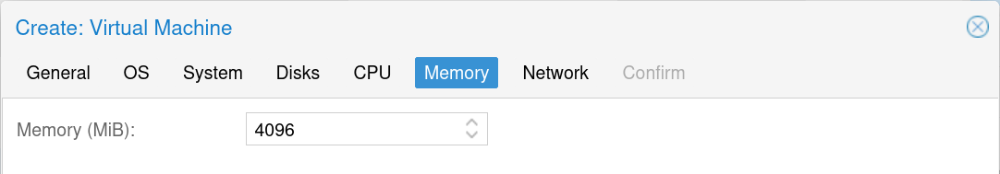

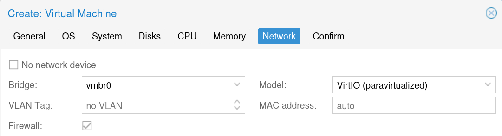

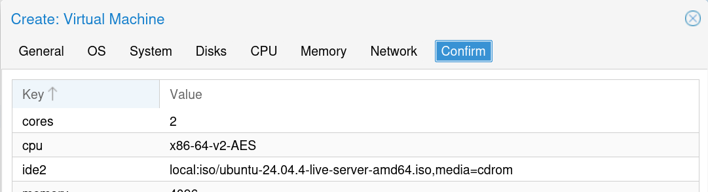

Nach der Zusammenfassung auf *Finish* klicken.  
Nach kurze Zeit erscheint die VM mit Namen in der linken Spalte.  

* Starte die VM über rechte Maustaste (RMT) oder Button rechts oben.
* Starte die Console über RMT oder Button rechts oben.

**Eigentliche Ubuntu-Installation**  

Auf der Console siehst du für 30 Sekunden den Startbidschirm von Ubuntu, 
bevor es weiter zur Installation geht. Bitte Beachte, dass *Console* hier 
nicht (aber auch) für das Terminal einer virtuellen Maschine steht. Hier kann das auch eine GUI sein!.
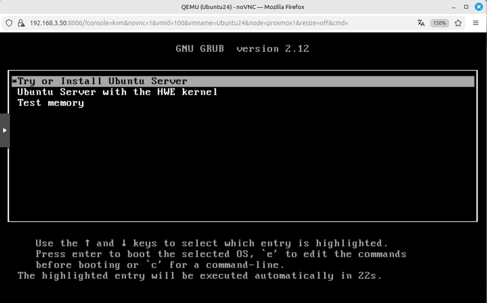

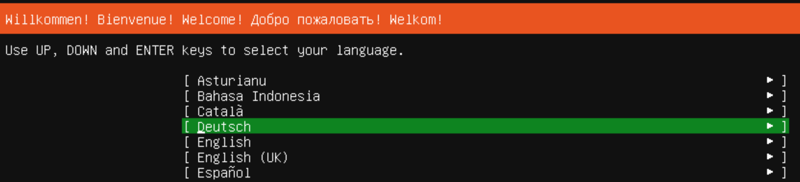

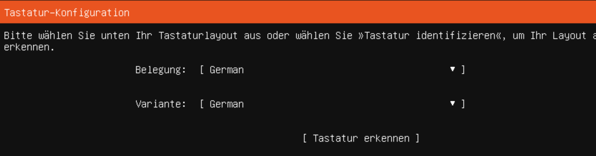

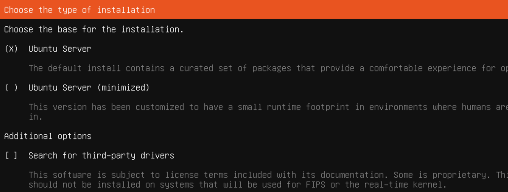

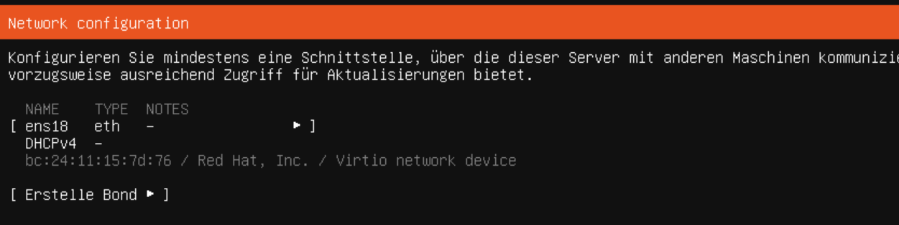

Bei den Netzwerkeinstallungen kannst du mit der TAB-Taste navigieren und 
Untermenüs mit der LEER-Taste öffnen. In *deinem* Netz kannst du hier Einstellungen vornehmen, im Schulungszentrum lassen wir die Voreinstellungen.

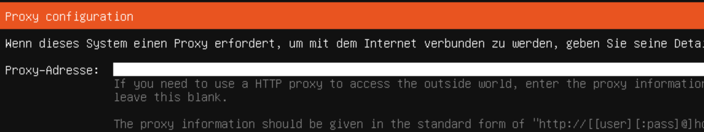

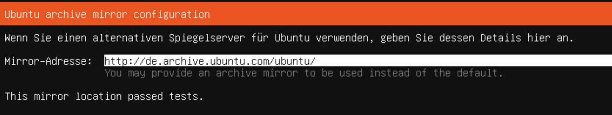

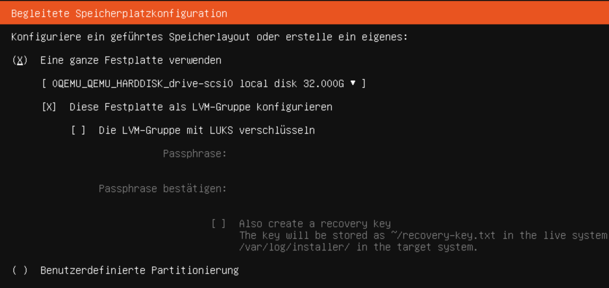

LVM ist deutlich komplexer als eine *reine* Festplatte. Aus diesem 
Grund hier evtl. mit TAB und LEER den Haken entfernen.

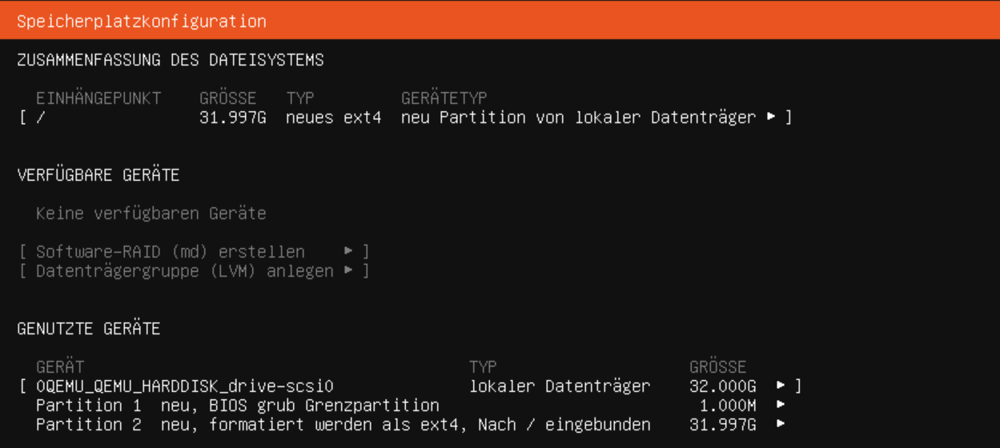

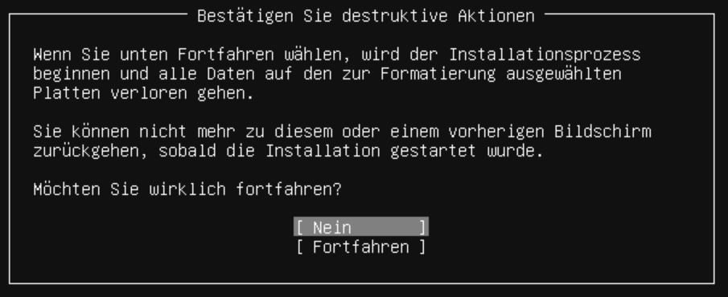

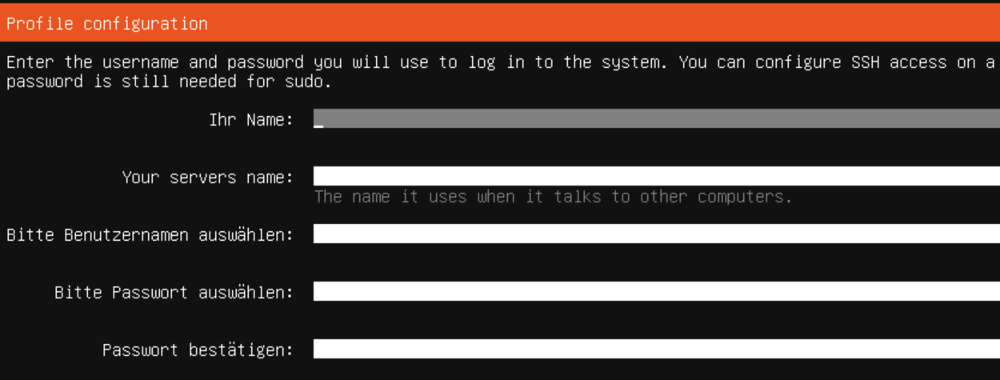

Die weiteren Anleitungen gehen von einem Benutzer mit Namen *benutzer*
und dem Kennwort *gitkurs* aus.

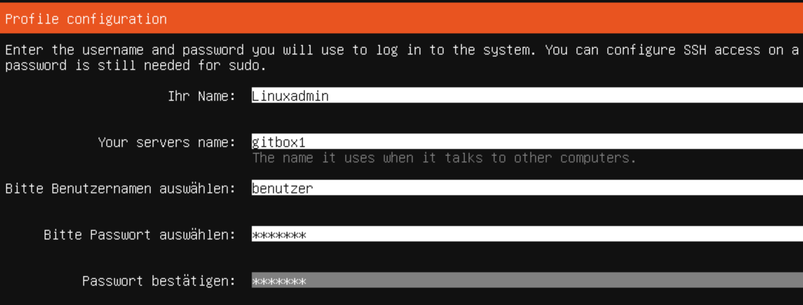

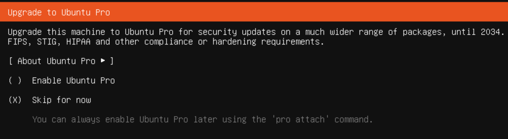

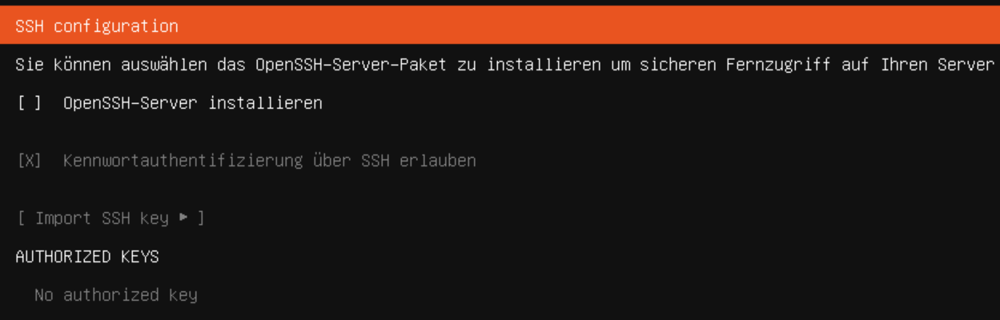

Keys haben wir aktuell keine zum Importieren.

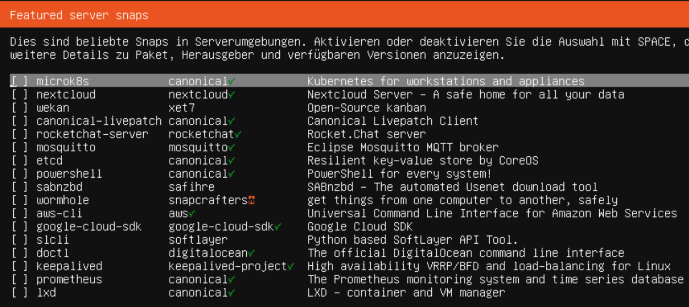

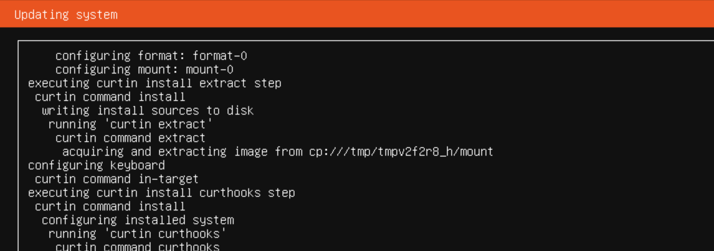

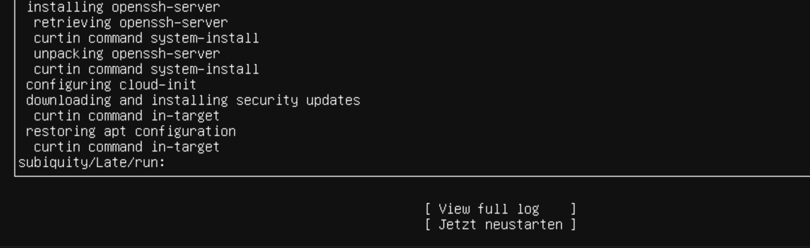

Es wird ein Druck auf die ENTER-Taste gefordert, um das iso-Image 
auszuhängen. Danach läuft der *Reboot* durch.

Im Console-Fenster ist jetzt vollwertiges Arbeiten möglich -- wir wollen das zukünftig aber dennoch über ssh machen.

Um die Installation abzurunden, bringen wir das System auf den aktuellen 
Stand. Dafür einmal anmelden als *benutzer* mit Kennwort *gitkurs* (s.o.).

```bash
sudo apt update 
(Kennwort gitkurs)
sudo apt upgrade -y
```

**Rückfallsicherung**  
Du hast jetzt eine schöne, saubere, nagelneue Ubuntu-Installation.
Vielleicht ist es eine gute Idee, sich diese Installation als Schablone 
zur Seite zu legen, um bei Bedarf einfach eine Kopie erstellen zu können.

Das geht wieder im linken Bereich RMT - *convert to template*, setzt aber voraus, dass du 
das Ubuntu zunächst herunter fährst. Aus dem Terminal geht das schnell
über 

```bash 
sudo halt -p 
```

Dieses Template musst du clonen, um weiterarbeiten zu können --
auch das wieder RMT im linken Bereich.  
Ein *linked-Clone* ist super, weil er nur die Differenzen zur
Vorlage speichert und extrem schnell erstellt ist. Ein *full-Clone* 
kopiert wirklich die Vorlage. Diese darf später dann auch gelöscht werden, ohne dass es Probleme gibt.

Vorsicht: Die MAC-Adresse wird dabei geändert. Eigentlich sollte der 
DHCP-Server dann eine neue IP-Adresse vergeben. Bei meinem Router klappt das gerade eben nicht. Die aktuelle Adresse bekommst du über die 
Console im Webinterface durch 

```bash
sudo ip addr show 
```

