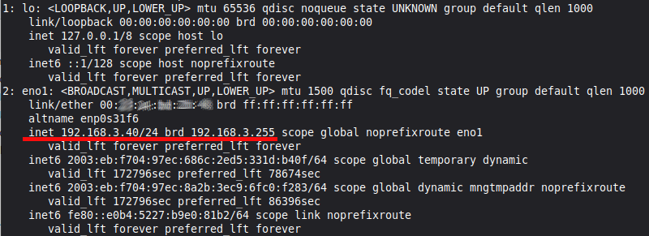

## Vorbereitung des Systems

Nachfolgend wird die Installation eines funktionsfähigen \gitservers
beschrieben. Bevor Du dich an die Installation auf einem Server
im Internet machst, ist etwas *Training* in einer virtuellen Umgebung
ganz sinnvoll. Nach der Installation und Konfiguration eines Übungsservers 
in VirtualBox sind die Schritte identisch mit der realen Situation.  
Die Anleitung zur Installation von VirtualBox 
und dem entsprechenden Gastsystems *Ubuntu-24.04* befindet sich am Ende 
des Handouts. Gegebenenfalls also zuerst dort fortfahren und dann erst 
hierher zurückkehren.

TODO: VirtualBox Anleitung erstellen

### Grundkonfiguration
Alle erforderlichen Konfigurationsschritte erfolgen über ssh im Terminal auf dem Server.
In der virtuellen Maschine kann dies zwar auch direkt aus VirtualBox heraus erfolgen, 
zum *üben* ist es aber auch hier sinnvoll, sich mit ssh auf die VM zu verbinden.

#### SSH-Verbindung
##### Windows
Seit einiger Zeit kann auch Windows auch ohne Zusatzsoftware SSH-Verbindungen 
aufbauen. Allerdings unterliegt die `cmd.exe` einigen Einschränkungen
(z.B. kopieren von Textinhalten), die bei der Verbindung mit Putty 
oder der git-Bash besser gelöst sind.  

Putty kann unter [https://www.chiark.greenend.org.uk/~sgtatham/putty/latest.html](https://www.chiark.greenend.org.uk/~sgtatham/putty/latest.html) 
als einzelne Datei heruntergeladen werden und erlaubt die Erstellung von 
Verbindungsprofilen. Ich gehe davon aus, dass du mit diesem Tool selbst klar kommst.

TODO: Bild Putty-Anmeldung

**Windows direkt**  
Starte die Commandozeile `cmd.exe` und gib folgenden
Befehl ein (Benutzer und IP-Adresse müssen bekannt sein, ebenso das Kennwort):

TODO: Unterschied cmd und putty

```bash
ssh benutzer@ip-adresse 
```

Es erscheint eine Sicherheitsabfrage, die mit `yes` und `enter` bestätigt 
werden muss:

TODO: Als Bild einbinden

```bash
The authenticity of host 'try.example.com (38.243.220.195)' can't be established.
ED25519 key fingerprint is SHA256:DSeSsfXDL2PkSlLYCt64krg9xa2vNr3og5SBJzZ/WNk.
This key is not known by any other names.
Are you sure you want to continue connecting (yes/no/[fingerprint])?
```

\samplestart
**Hintergrund**  
Der Rechner merkt sich den Fingerabruck des Servers, zu dem die Verbindung
aufgebaut wurde. Sollte später ein anderer Server diese IP-Adresse übernehmen
(z.B. Man in the middle), so stimmt der Fingerabdruck nicht und es gibt eine
Warnung.
\sampleend

**Git-Bash**
Da das eine abgespeckte Linux-Umgebung ist, kannst du im nächsten Abschnitt 
weiterlesen.


##### Apple und Linux
Auch hier erfolgt der Verbindungsaufbau in gleicher Weise direkt aus dem Terminal.

Die Eingabe des Kennworts kann je nach Installationsvariante auch ohne 
sichtbare Zeichen erfolgen!

Eine ssh-Verbindung kann auf verschieden Weise wieder abgebaut werden:

* brutal, geht aber: Fenster schließen
* `exit()` 
* `logout`
* \strg{d}


#### Software installieren
Bei *Ubuntu-24.04* ist in der Standard-Installation die Versionsverwaltung \git
bereits vorinstalliert und auch der ssh-Server sollte bereits funktionieren.
Bei gemieteten Installationen muss das nicht so sein, ssh sollte aber funktionieren.
Für die Verbindung mit ssh benötigt man die IP-Adresse. Von einem Mietserver kennt man
die Adresse im Regelfall, in VirtualBox muss man sie erst im Terminal ermitteln, da sie 
vom DHCP-Server zugewiesen wird.

\samplestart
**Hinweis**  
Falls man \git im Klassenzimmer betreibt (was nicht besonders sinnvoll ist)
und eine gewisse *Konstanz* in den Unterrichtsverlauf bringen möchte, 
dann sollte der Systemadministrator diese virtuellen Maschine 
in den DHCP-Server eintragen, damit sie immer die gleiche IP-Adresse
bekommt!
\sampleend

```bash
ip addr show
```

Je nach Anbieter des Systems kann die Bildschirmausgabe etwas anders aussehen!



Der veraltete Befehl `ifconfig` kann jederzeit nachinstalliert werden durch

```bash
sudo -i           # Admin werden
apt-get update    # Software-DB aktualisieren - dauert!
apt-get install net-tools  # mit y oder J bestätigen
```

\samplestart
**Hinweis**  
Zum Installieren von Software gibt es auf Linux verschiedene
Programme: *apt, apt-get, aptitude, snap, flatpak, appimages, ...*.
Eine detaillierte Beschreibung ginge hier zu weit. In diesem
Workshop wird nur mit *apt, apt-get* und `aptitude` gearbeitet.
Diese drei Programme verwenden die gleiche Datenbank für 
verfügbare Software und sind somit weitgehend identisch. *Aptitude*
verfügt über eine -- für mich -- schönere Suchfunktion. Aus diesem Grund 
installieren wir es hier gleich nach. 
\sampleend

```bash
apt-get install aptitude -y
```

**Check auf installiertes git**  
```bash
git --version
```

Falls eine Fehlermeldung erscheint, muss \git noch installiert werden:

```bash
apt update 
apt get install git -y
```


#### Firewall
Je nach Anbieter ist auf dem Server eine Firewall aktiv oder auch nicht.
Den Status erfragt man mit `ufw status`. Hierbei steht `ufw` für *uncomplicated firewall*.
Bei Änderungen an der Firewall immer Vorsicht walten lassen! 
Man kann sich aussperren!

**Ablauf**  

```bash
IN:   ufw status
OUT:  Status: inactive

IN:   ufw allow ssh 
OUT:  Rules updated
      Rules updated (v6)

IN:   ufw enable
OUT:  Command may disrupt existing ssh connections. 
      Proceed with operation (y|n)?
IN:   y
OUT:  Firewall is active and enabled on system startup
```

#### Ordner für Repository
Wo man diesen im Verzeichnisbaum von Linux anlegt, ist im Prinzip
unwichtig -- es gibt aber bessere und schlechtere Orte. Der Home-Ordner
ist keine gute Idee -- besser ist z.B. der Ordner `/srv`. Dort erstellen
wir auch gleich ein Demo-Repository:

```bash
sudo -i
cd /srv 
mkdir repositories
chown git:git repositories 
*strg + d*
cd /srv/repositories
git init --bare demo.git
cd demo.git 
git branch -m main 
```

Dieses Repositoriy ist nun bereit zum Clonen.

### Benutzer für Git

Wenn ein Schüler nur \git verwenden soll, dann braucht 
er dafür kein vollwertiges Benutzerkonto, an dem er sich
auch für andere Arbeiten anmelden kann. Für die Verwendung 
von \git genügt es bereits, wenn man einen einzigen Benutzer mit dem Namen 
\git (als Beispiel) erstellt.  

Nötige Schritte:

* Dem Benutzer \git wird eine *echte* Anmeldung unmöglich gemacht.
* Schüler erstellen sich SSH-Schlüssel-Paare
* Sie schicken ihren Public-Key per Mail an den Lehrer
* Der Lehrer fügt den Schlüssel in die Datei
   `/home/git/.ssh/authorized_keys` ein.

**Benutzer anlegen**  
```bash
useradd -m git
passwd git  # Das Kennwort wird 2x unsichtbar abgefragt.
```

**Anmeldung deaktivieren**
```bash
nano /etc/passwd 
```
Den Benutzer \git  suchen und am Ende der Zeile aus `/bin/sh`
den Eintrag `/bin/false` machen. Nun mit der Tastenkombination
\strg{o} und `\strg{x} die Änderung abspeichern.

**Erstellen eines Schlüsselpaars**  
Unter Linux / MacOS einfach eingeben:
```bash
ssh-keygen -t rsa -b 4096 -C "schueler@example.com"
```
Als Dateiname *schule* vergeben und die Fragen nach einer PassPhrase
beide Male mit der Enter-Taste übergehen.

Unter Windows geht das ab Windows 10 mit dem gleichen Befehl 
aus der *cmd.exe* oder *powershell*. 
Frühere Versionen müssen PuTTYgen verwenden -- Anleitung z.B.
über KI. Bei der Vorbereitung des Workshops hat sich 
das Erstellen des Schlüsselpaares hier allerdings als ziemlich 
problematisch erwiesen. Mit Standardnamen im Standardordner ging
es problemlos, bei Angabe eines anderen Namens wurde es kompliziert.

TODO: Überarbeiten Key unter WIndows.

**Zuschicken der Datei `schule.pub` per Mail**  
Sollte klar sein. Durch die Wahl von *schule* wird das Schlüsselpaar 
auch nicht im versteckten Ordner `.ssh` angelegt, sondern sichtbar 
direkt unter `c:\user\BENUTZER`.

TODO: Das klappt noch nicht

**Kopieren des Schlüssels**  
Der Schlüssel muss aus der eMail in die Datei 
`/home/git/.ssh/authorized_keys` eingetragen werden.

TODO: Klappt das über \strg{c}

Die Schüler sollten nun kennwortfrei mit \git arbeiten können.  
Beim Einsatz einer Weboberfläche (später im Script) müssen die
Schüler diesen Schlüssel selbst dort im System registrieren. 

\samplestart
**Hintergrund**  
Nach der Anmeldung über ssh wird über die Einstellungen im 
Benutzerkonto entschieden, welche Art von Terminal der Benutzer
erhält. Üblich ist die \verb+bash, sh, csh, ...+. Wird hier 
ein \textit{ungültiges} Terminal eingetragen, so ist eine Anmeldung
auf diese Weise nicht mehr möglich. Für \git  spielt diese
allerdings keine Rolle, da hierfür das Terminal nicht gestartet 
werden muss. Da trotzdem eine Art von Anmeldung für den Zugriff auf
\git  erfolgen muss, wird das Public-Key-Verfahren verwendet.

Hier muss entschieden werden, wer für die Schlüssel zuständig
ist. 
\sampleend

**Varianten**  

* Der Lehrer erstellt Schlüsselpaare für die Schüler, die sie auf
    den verwendeten Geräten (Schule, Zuhause) hinterlegen und die 
    vom Lehrer auf dem Server freigeschaltet werden. Dies kann
    zu Problemen führen, falls Schüler bereits aus anderen Gründen 
    mit ssh arbeiten und deshalb schon Schlüssel besitzen^[Auch das
    kann im Prinzip konfiguriert werden, stellt aber höhere 
    Anforderungen an den Benutzer]. 

* Der Schüler erstellt selbst das Schlüsselpaar oder bringt
  sein eigenes mit (ausdrücklich NICHT empfohlen, da der Private-Key 
  dann auf einem Schulrechner liegt!). Er muss dann eigenständig seinen 
  Public-Key auf dem Server hinterlegen.
  Das ist auch problematische, weil der Schüler zunächst das Kennwort 
  für den Benutzer \git besitzen muss. 
  Nach dem Hinterlegen des Schlüssels ist es dann die Aufgabe des Lehrers, 
  den Account zu sperren.

* Der Schüler erstellt für die Schule und zuhause unabhängige Schlüsselpaare.
  In diesem Fall müssen beide Schlüssel auf dem Server als gültig eingetragen 
  werden. 

