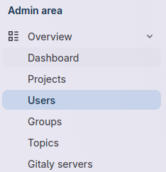
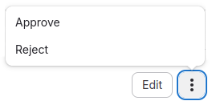
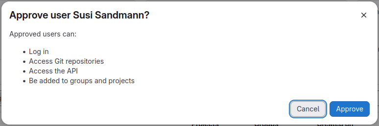

# Gitlab

Diese Software ist etwas schwergewichtiger als \gitea,
aber ebenso problemlos zu installieren. Auch hier stellt 
sich wieder die Frage nach dem zu verwendenden 
ssh-Port z.B. zum Clonen. Ich selbst habe den ssh-Port des 
Servers auf 23 umgestellt, damit \gitlab die 22 verwenden kann. 

Nach dem komplexen Aufbau von \gitea mit seinem Runner, wirkt 
\gitlab richtig pflegeleicht!

## Umstellen des Ports

Melde dich auf dem Server an und werde *root*.
Suche in der Datei \datei{/etc/ssh/sshd\_config} nach der 
Zeile **# Port 22** (Auskommentiert). Entferne den 
Kommentar und ersetze 22 durch 23. (Speichern nicht vergessen!)

**WICHTIG WICHTIG WICHTIG**  
Vergiss nicht, auf der Firewall auch Port 23 freizuschalten:

```bash
ufw disable 
ufw allow 23/tcp 
ufw enable 
ufw status verbose
```

Nun muss der Dienst neu gestartet werden. Bei den letzten Tests
hat der Befehl \cmd{systemctl restart ssh} den Dienst aber nicht
auf den anderen Port umgestellt (wegen laufender Verbindung?).
Linux-untypisch war ein Reboot die Lösung (im Terminal \cmd{reboot} eingeben). 
Mittlerweile habe ich herausgefunden, dass ein vorher ausgeführtes
\cmd{systemctl daemon-reload} das Problem löst! Damit ist kein Reboot mehr nötig.

## Docker

Erstelle einen Ordner für \gitlab 

```bash
mkdir -p /home/benutzer/docker/gitlab25
cd /home/benutzer/docker/gitlab25
```

Kopiere die Datei \datei{docker-compose.yml} aus dem Materialordner \ordner{gitlab}
an diese Stelle. Passe unbedingt die IP-Adresse an!

```bash
version: '3.6'
services:
  web:
    image: 'gitlab/gitlab-ce:latest'
    container_name: 'gitlab'
    restart: always
    hostname: '192.168.3.190'  # Im Netz 'gitlab.server.de'
    environment:
      GITLAB_OMNIBUS_CONFIG: |
        external_url 'http://182.168.3.190:443' # im Netz https
        gitlab_rails['gitlab_shell_ssh_port'] = 22
    ports:
      - '22:22'  # 25:22 falls 22 nicht auf 23 umgestellt
      - '80:80'
      - '443:443'
    volumes:
      - ./config:/etc/gitlab
      - ./logs:/var/log/gitlab
      - ./data:/var/opt/gitlab
    shm_size: '256m'
    networks:
      - gitlab_net

networks:
  gitlab_net:
    external: true
```

Das Netz für \gitlab muss explizit angelegt werden,
da es *external* ist, aber das kennst du bereits:

```bash
docker network create gitlab_net 
```

Nun das Image erstellen (wird bei \cmd{docker compose up} implizit mit 
erledigt, aber wir machen es schrittweise.)

```bash
docker compose up --build
```

Hier ist nun eine längere Kaffepause angebracht!  
Das *länger* ist im Sinne von 20 Minuten+ gemeint und hängt
stark vom verfügbaren Hauptspeicher ab. Mit 2GB bin ich an die 
Wand gelaufen und musste im Nachhinein Auslagerungsspeicher 
zur Verfügung stellen. Hier ist die Code-Sequenz, falls das bei dir 
auch nötig werden sollte. Überwache den Speicherverbrauch in einem 
zweiten Terminal mit dem Befehl \cmd{top}.  

```bash
sudo -i 
fallocate -l 4G /swapfile
chmod 600 /swapfile
mkswap /swapfile
swapon /swapfile
```


Mit dem nachfolgenden Befehl kann das Erstkennwort 
für \gitlab ausgelesen werden:

```bash
sudo cat config/initial_root_password
```

Damit ist eine Anmeldung als *root* auf der 
Weboberfläche möglich. Hier muss nun auch sofort 
das Kennwort geändert werden (Wieder ist das Erstkennwort erforderlich!).

Mit diesem *docker-compose*-Setup ist ssh-clonen
bereits möglich (sobald der ssh-Key im Profil hinterlegt ist). 
Solltest du auf dem Host einen anderen Port 
verwenden (gitlab arbeitet intern dennoch mit 22), dann clonst   
du so (z.B. über Port 25):

```bash
git clone ssh://git@192.168.3.190:25/root/demo.git
```

**Folgeschritte**

* Neues Kennwort setzen
* Projekt demo.git erstellen
* Deinen public-Key in den Account eintragen (das muss jeder Benutzer machen!)

Ab jetzt kann vollwertig mit \gitlab gearbeitet werden -- über 
Konsole, GitClients, ... ,Weboberfläche.

## Einstieg in Gitlab

Da für bestimmte Aspekte Bilder aussagekräftiger sind, wird dieser 
Abschnitt deutlich bildlastiger werden. An dieser Stelle sei noch 
einmal betont, dass dieses Dokument eigentlich nicht für den Ausdruck 
gedacht ist! In einer PDF-Datei ist die Anzahl der Seiten mit 
Bildern ein geringeres ökoligisches Problem!

### Anmeldung

Wenn sich der root-Benutzer angemeldet hat, sollte er in seinem 
Profil (rechts oben) ein neues Kennwort festlegen. Dafür wird erneut 
das Einmalkennwort benötigt!

Für lokale Versuche bietet es sich an, dass 2 Browser oder der 
Inkognito-Modus verwendet werden, damit *root* und ein weiterer 
Benutzer gleichzeitig angemeldet sein können.

Ein weiterer Benutzer besitzt nach der Grundinstallation die 
Möglichkeit, sich selbst auf der Plattform zu registrieren.
Der diesbezügliche Dialog ist selbsterklärend und deshalb spare ich
mir das Bild.  

Nach der Registrierung ist allerdings noch keine Anmeldung am 
System möglich -- sie muss erst von *root* freigeschaltet werden.

{width=7cm}
{width=3cm}

{width=7cm}
{width=7cm}



Danach ist für den Benutzer die Anmeldung möglich und er kann eigene Projekte 
erstellen. Am Startbildschirm erscheint auch ein Hinweis (mit Link), dass 
noch ein ssh-Key eingetragen werden muss. Das ist natürlich nur nötig, wenn 
von extern (Client) auf die Repos zugegriffen werden soll.

\gitlab ist für einfache Szenarien relativ leicht zu überblicken, bei tiefergehender 
Beschäftigung muss allerdings viel Zeit eingeplant werden. Aus diesem Grund 
verzichte ich an dieser Stelle auf einen tieferen Einstieg. Das Anlegen eines 
Repositories (=Projekts) ist relativ einfach, das Erstellen, Editieren und Committen 
von Dateien ebenfalls. 

Interessanter ist die Verwendung von \gitlab im Zusammenhang mit CI/CD, was das Thema des 
nächsten Abschnitts ist.