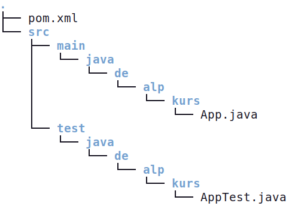

## Java 

### Idee 

Im Zusammenspiel von TDD und \git wäre ein Unterrichtsprojekt 
denkbar, wo Schüler alleine oder in Gruppen
verschiedene Methoden der Verschlüsselung implementieren.
Am Ende könnten dann die Einzelprogramme 
im *main*-Branch zusammengeführt werden. Hier soll aber \git nicht 
im Fokus stehen, sondern der TDD-Zyklus. Exemplarisch implementieren
wir eine minimale Cäsar-Verschlüsselung.


### Erstellen des Projektes

Im Terminal wird bei bereits installiertem Maven eine 
korrekte Ordnerstruktur initialisiert.

```bash
mvn archetype:generate  -Dfilter=quickstart
```
Den Vorschlag 132 übernimmst du einfach.
Nun müssen einige Parameter eingestellt werden:

```bash
Version: 1.5 (Taste 9)
groupID: de.alp.kurs
artifactID: caesar 
version: 1.0-SNAPSHOT
package: de.alp.kurs
Bestätigen: Y 
```

Das liefert folgende Struktur:



Dieses Projekt kann bereits (fast) compiliert werden. 
Zuerst müssen wir allerdings noch einige Einträge in der 
\datei{pom.xml} angepasst werden:

* die lokal installierte Java-Version in die \datei{pom.xml} eintragen. 
  Default ist 17, ich verwende 21. 
* Konfiguration des *jar*-Plugin:

\samplestart 
**Hinweis**  
Bei den letzten Tests für den Workshop war die Konfiguration 
des *jar*-Plugin nicht mehr nötig. Ich lasse den Code hier 
aber dennoch stehen!
\sampleend

```bash
...
<plugin>
    <artifactId>maven-jar-plugin</artifactId>
    <version>3.4.2</version>
    <configuration>
        <archive>
            <manifest>
                <mainClass>de.alp.kurs.Caesar</mainClass>
            </manifest>
        </archive>
    </configuration>
    </plugin>
...
```

Gib nun \cmd{mvn package}. *package* ist ein relativ großer LiveCycle, der
Compile, Test und Package umfasst. Am Ende entsteht ein *jar*-Archiv, das 
ausgeführt werden kann..

```bash
java -jar target/caesar-1.0-SNAPSHOT.jar
```

Mit der bisherigen Befehlssequenz hast du überprüft, ob der Setup 
von \maven funktioniert. Sieh dir nun die Vorlagedateien an, 
die automatisch generiert wurden:

```java
// Inhalt von App.java

package de.alp.kurs;

public class App {
    public static void main(String[] args) {
        System.out.println("Hello World!");
    }
}
```

Es handelt sich also um die übliche Startdatei.  
Die \datei{AppTest.java} ist umfangreicher:

```java
package de.alp.kurs;

import static org.junit.jupiter.api.Assertions.assertTrue;
import org.junit.jupiter.api.Test;

public class AppTest {
    @Test
    public void shouldAnswerWithTrue() {
        assertTrue(true);
    }
}
```

Genau an dieser Stelle steigen wir nun in TDD ein. Lies von
hier an nun ganz genau und führe auch wirklich *jeden* Schritt aus,
egal wie sinnlos er aktuell für dich wirkt! Mir ist bewusst, dass
es unendlich viele verschiedene Ansätze zur Implementierung 
eines Cäsar-Algorithmus gibt. Ich werde hier sicher nicht 
den elegantesten oder performantesten Ansatz verfolgen, denn
ich will schließlich TDD demonstrieren und keine Programmierkurs 
halten! Aus diesem Grund wird auch nicht jeder Edge-Case abgefangen.

Ich möchte allerdings als Hauptklasse nicht *App*, sondern *Caesar*.
Das erreichst du einfach, indem du an folgenden Stellen Umbenennungen 
vornimmst:

* App.java -> Caesar.java
* In dieser Datei den Klassennamen auf *Caesar* ändern
* AppTest.java -> CaesarTest.java
* In dieser Datei den Klassennamen auf *CaesarTest* ändern
* In der Datei \datei{pom.xml} im *jar*-Plugin die MainClass umbenennen

Zur Kontrolle führst du gleich wieder ein \cmd{mvn package} aus. 
Wenn das ohne Fehler abgearbeitet wird, kannst du mit TDD beginnen.


### Schrittweises TDD

Es gibt viele Regeln beim TDD und eine davon ist, dass triviale 
Getter und Setter nicht getestet werden. Das einfache Setzen einer 
(privaten) Variablen stellt keinen kritischen Code dar. Beginne 
also mit einem Setter für den Klartext in der Datei \datei{Caesar.java}


```java
package de.alp.kurs;

public class Caesar {
    private String cryptText = "";
    private String clearText = "";

    public static void main(String[] args) {
        System.out.println("Hello World!");
    }
        
    public void set_clearText(String clearText){
        this.clearText = clearText;
    }
}
```

Nun schreibst du in der Datei \datei{CaesarTest.java} den ersten 
Test für eine nicht existierende Funktion. Bei Hard-Core TDD würdest 
du bereits die reine Existenz der Funktion mit Hilfe von Reflections
testen -- so weit möchte ich nicht gehen. Deshalb testen wir, ob die 
Funktion einen Text zurückliefert:

```java
@Test 
public void cryptLiefertEineRueckgabe(){
    Caesar caesar = new Caesar();
    String res = caesar.crypt();
    assertNotNull(res);
}
```

Der Befehl \cmd{mvn test} scheitert, wegen der fehlenden Methode 
bereits beim Compilieren.
Du schreibst zunächst folgende Variante der Methode:

```java
public String crypt() {
        return null;
    }
```

Der Test geht natürlich immer noch schief, aber das ist wichtig, denn 
du weißt nun, dass die Methode überhaupt überprüft wird.  
Nun änderst du die Rückgabe auf einen beliebigen String. Das ist der einfachst Weg, 
damit der Test nicht mehr scheitert.

```java
public String crypt() {
        return "x;
    }
```


Nun beginnt der Denkprozess, was wir von der Methode an Edge-Cases erwarten.
Wenn es keinen Klartext gibt, soll die Rückgabe ein leerer String sein.
Liegt ein Klartext vor, so soll Text zurückgeliefert werden. Hier müssen 
wir bereits überlegen, wie wir mit Sonderzeichen umgehen, die mit Caesar 
nicht sinnvoll behandelt werden können. Das ist eine Design-Entscheidung
noch vor der Implementierung. Wenn wir annehmen, dass alle solchen Zeichen 
durch Minuszeichen ersetzt werden, dann sollte der verschlüsselte Text 
die gleiche Länge wie der Klartext besitzen. 

Das sind gleich zwei Tests -- du solltest ein Blatt mitführen, was noch zu 
erledigen ist^[Beim TDD sollte ein Test immer nur genau eine Sache testen!]:

* cryptLiefertLeerWennKeinKlartext()
* cryptLiefertTextKorrekterLaenge()

```java
@Test
    public void cryptLiefertLeerWennKeinKlartext(){
        Caesar caesar = new Caesar();
        caesar.set_clearText("");
        String res = caesar.crypt();
        assertEquals(0, res.length());
    }
```

Der Test scheitert wie gewünscht, weil ja „x“ nicht die Länge Null 
besitzt. Wir brauchen also eine Rückgabe, die etwas sinnvoller ist.

```java
public String crypt() {
       return cryptText;
    }
```

Der Test läuft nun wieder auf grün -- passt alles!
Probieren wir als Test einen längeren Text:

```java
 @Test 
    public void cryptLiefertTextKorrekterLaenge(){
        Caesar caesar = new Caesar();
        caesar.set_clearText("hallo");
        String res = caesar.crypt();
        assertEquals("Hallo".length(), res.length());
    }
```

Da die Variable *cryptText* ja leer ist, muss dieser Test 
wieder scheitern. Die nächste Änderung im Code steht an:

```java
public String crypt() {
        cryptText = clearText;
        return cryptText;
    }
```

Und wieder grün. Allerdings macht *crypt()* immer noch 
keinen sinnvollen Job! Das kann auch gar nicht gehen, weil 
ja noch gar keine Verschiebung definiert wurde und der Klartext 
die Säuberung der Sonderzeichen noch nicht durchlaufen hat.
Aus Zeitgründen verzichten wir auf die Säuberung und schreiben 
schnell einen Setter für die Verschiebung:

```java
public void setVerschiebung(int verschiebung){
        this.verschiebung = verschiebung;
    }
```

Das Kodieren ist ja eine Abfolge von Verschiebungen.
Testen wir also zunächst die Verschiebung eines 
einzigen Buchstabens, bevor wir irgendwo eine 
Schleife basteln:

```java
@Test
    public void shiftCharInDerMitteUm1(){
        Caesar caesar = new Caesar();
        caesar.setVerschiebung(1);
        char c = caesar.shiftChar('m');
        assertEquals('n', c);
    }
```

Rot-Phase ...

```java
public char shiftChar(char buchstabe) {
        return 'n';
    }
```

Grün-Phase -- alles gut, aber nicht funktional.

```java
@Test
    public void shiftCharInDerMitteUm_n_kleiner_wert(){
        Caesar caesar = new Caesar();
        caesar.setVerschiebung(5);
        char c = caesar.shiftChar('m');
        assertEquals('r', c);
    }
```

Wir sind wieder bei *rot*, weil wir nun echt arbeiten müssen!

```java
public char shiftChar(char buchstabe) {
        int ascii = buchstabe + verschiebung;
        return (char)ascii;
    }
```

Wieder haben wir *grün* erreicht -- allerdings nur für 
kleine Verschiebungen im der Mitte des Alphabets.
Wollen wir zum Beispiel „x“ verschieben, so wird nicht „c“
entstehen. Aber dafür schreiben wir einen Test:

```java
@Test
    public void shiftCharAmRandUeberKante(){
        Caesar caesar = new Caesar();
        caesar.setVerschiebung(5);
        char res = caesar.shiftChar('x');
        assertEquals('c', res);
    }
```

Klarer Fall von *rot*. Auf zum Ändern des Codes!

```java
public char shiftChar(char buchstabe) {
        int ascii = buchstabe + verschiebung;
        if (ascii > 122) {
            ascii = ascii - 26 ;
        }
        return (char)ascii;
    }
```

Ja -- das geht eleganter, ist hier aber egal!
Wir könnten nun auch noch um Verschiebungen in 
negative Richtung implementieren, aber das bringt 
uns thematisch nicht weiter.

Was testen wir nun? Die Methode *crypt* könnten
wir nun weiter ausbauen.

```java
@Test
    public void cryptCodiertStandardKorrekt(){
        Caesar caesar = new Caesar();
        caesar.setVerschiebung(5);
        caesar.set_clearText("aaaa");
        String res = caesar.crypt();
        assertEquals("ffff", res);
    }
```

Eine Variante, um wieder nach grün zu kommen, wäre 

```java
public String crypt() {
        StringBuilder sb = new StringBuilder();
        for (int i=0; i < clearText.length(); i++){
            char c = shiftChar(clearText.charAt(i));
            sb.append(c);
        }
        return sb.toString();
    }
```

Und ja -- auch das geht anders. Ich glaube aber, dass 
mit den bisherigen Schritten zumindest die Idee des TDD so 
weit klar geworden ist. Damit ist man natürlich noch ewig 
weit von der Routinearbeit eines professionellen entwicklers
entfernt! Es gibt neben TDD auch noch andere Ansätze wie 
BDD (Behaviour Driven Development), wie es gerne bei der 
Sprache Ruby on Rails mit Hilfe von Cucumber verwendet wird,
nur da ist bei mir dann auch Ende, weil ich von diesem Weg 
irgendwann abgebogen bin. Man kann einfach nicht jeden Weg gehen
und in diesen Sinne hoffe ich, dass dieser Workshop zumindest einige 
lehrreiche Aspekte beinhaltet hat. 


